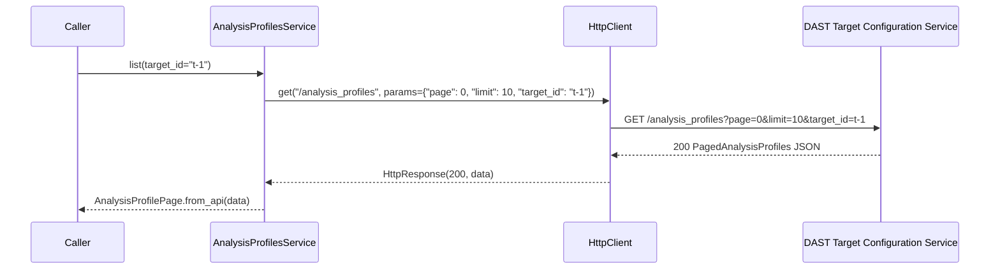
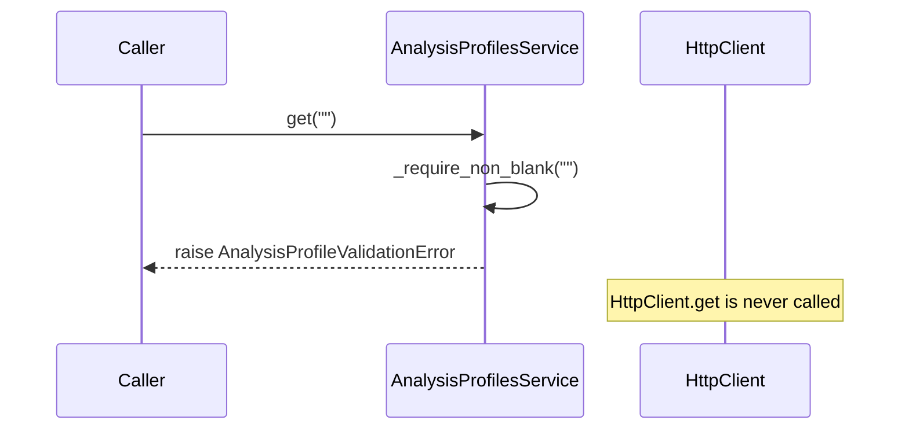
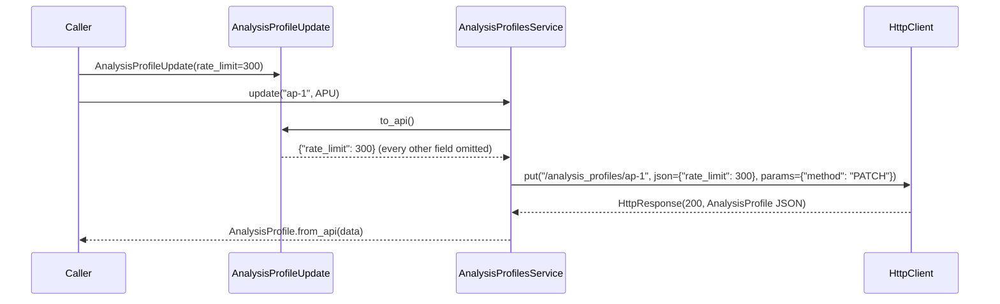

# Design — Analysis Profiles

Implements the requirements in [requirements.md](requirements.md), within
the architecture and conventions defined in [AGENTS.md](../../AGENTS.md).
Consumes [specs/http-client](../http-client/design.md) (`HttpClient`,
`HttpResponse`, the `VeracodeApiError` hierarchy),
[specs/target-management](../target-management/design.md)
(`TARGET_CONFIGURATION_SERVICE_BASE_URL`, the shared `HttpClient` instance,
the `_UNSET`-sentinel partial-update pattern), and
[specs/api-specification-management](../api-specification-management/design.md)
(`ApiSpecification`, `ScopeRule`, `ScopeType`, `ScopeRuleType`) — without
modifying any of them.

---

## 1. Overview

This feature adds the fourth Service in the SDK's layered architecture,
and the first one that reuses an already-configured `HttpClient` instance
end-to-end rather than owning its own base URL:

```
VeracodeClient      ← extended (client.py: wires client.analysis_profiles)
      ↓
  HTTP Client        ← already built; same instance as client.targets
      ↓
   Services          ← THIS FEATURE (services/analysis_profiles.py)
      ↓
    Models           ← THIS FEATURE (models/analysis_profile.py,
      ↓                  models/common.py), reusing
  REST API             models/api_specification.py
```

`AnalysisProfilesService` depends only on an injected `HttpClient`
instance — it never imports `requests`, `auth.py`, or `config.py`, and
never constructs its own `HttpClient`. All three of its methods map 1:1
onto a REST operation:

| Method | Backing |
|---|---|
| `list`, `get`, `update` | Directly backed by one REST call each (§4). |

Unlike Target Management, this feature adds **no** convenience method
(`get_by_name`, `exists`, `ensure`) — the REST API gives no filter that
would make one meaningful (requirements.md §12.3) — and **no** create/
delete (the REST API exposes neither).

---

## 2. Architecture

### 2.1 Base URL reuse

Analysis Profiles live under the same DAST Target Configuration Service
domain as Targets and API Specifications
(`https://api.veracode.com/dae/api/tcs-api/api/v1`, per
[AGENTS.md §3.3](../../AGENTS.md#33-supported-veracode-api-domains)). This
feature does **not** define a new base-URL constant. `client.py` already
constructs one shared `HttpClient` for this domain and hands it to both
`TargetsService` and `ApiSpecificationsService`:

```python
tcs_http_client = HttpClient(base_url=TARGET_CONFIGURATION_SERVICE_BASE_URL, auth=auth)
self.targets = TargetsService(tcs_http_client)
self.api_specifications = ApiSpecificationsService(tcs_http_client)
```

`AnalysisProfilesService` is wired the same way, extending this line
rather than introducing a fourth `HttpClient` instance (§6.4).

### 2.2 Model reuse

Two nested shapes inside `AnalysisProfile`/`AnalysisProfileUpdateRequest`
are **identical** to shapes already modeled by API Specification
Management:

| OpenAPI schema | Already modeled as | Reused by |
|---|---|---|
| `ApiSpec` | `ApiSpecification` (`models/api_specification.py`) | `AnalysisProfile.api_spec` |
| `ScopeRule` | `ScopeRule` (`models/api_specification.py`) | `AnalysisProfileUpdate.scope_rules` |
| `ScopeTypeEnum` | `ScopeType` (`models/api_specification.py`) | via `ScopeRule.scope_type` |
| `ScopeRuleTypeEnum` | `ScopeRuleType` (`models/api_specification.py`) | via `ScopeRule.scope_rule_type` |

This feature imports all four from `models/api_specification.py` instead
of redefining them. The only addition needed there is a `ScopeRule.to_api()`
method (§5.3) — `ScopeRule` currently only has `from_api()`, since API
Specification Management only ever reads scope rules, never writes them.

### 2.3 A new shared module: `models/common.py`

Thirteen fields on `AnalysisProfile` share one wrapper shape:
`{"effective_value": <T>, "is_inherited": bool}`. Rather than define
thirteen near-identical dataclasses, this feature introduces one generic,
`models/common.py`:

```python
InheritedValue[T]
```

This is a new file, not an extension of an existing one — Phase 1 had no
resource whose response schema repeats a wrapper shape this many times, so
no shared-model location existed yet. It is intentionally generic (`T`,
not e.g. `InheritedStringList`) because the same shape wraps `list[str]`,
`bool`, `int`, `float`, and two different enums within this one schema
alone — a non-generic version would still require one class per wrapped
type.

---

## 3. Service Responsibilities

`AnalysisProfilesService` (`src/veracode_dast/services/analysis_profiles.py`):

- Translates `list`/`get`/`update` into `GET`/`GET`/`PUT` calls against the
  injected `HttpClient`.
- Builds `AnalysisProfilePage`/`AnalysisProfile` from response bodies via
  `from_api()`.
- Builds the `PUT` request body from `AnalysisProfileUpdate.to_api()`, and
  always adds `method=PATCH` to the query string (§3.3).
- Guards `analysis_profile_id` against blank input before any HTTP call,
  raising `AnalysisProfileValidationError`.
- Emits INFO-level logs naming the operation and `analysis_profile_id`/
  counts, never business-data field values.
- Holds no state beyond the injected `HttpClient` (Stateless principle).

It explicitly does **not**:

- Know about Targets, Teams, or API Specifications as *resources* — it
  never imports `TargetsService`, `TeamService`, or
  `ApiSpecificationsService`. It only reuses two of API Specification
  Management's *models* (§2.2), which is a models-layer dependency, not a
  services-layer one.
- Implement any sub-resource under `/analysis_profiles/{id}/*`
  (requirements.md §0.2, §12.1).
- Retry, cache, or paginate beyond a single `GET` per `list()` call.

---

## 4. Class Design

### 4.1 `src/veracode_dast/models/common.py` (new)

```python
"""Small, generic model shapes shared across Veracode DAST resources."""

from __future__ import annotations

from dataclasses import dataclass
from typing import Generic, TypeVar

T = TypeVar("T")


@dataclass(frozen=True)
class InheritedValue(Generic[T]):
    """A configuration value that may be inherited from a parent Analysis
    Profile.

    Mirrors the repeated `{"effective_value": ..., "is_inherited": ...}`
    shape in the OpenAPI `AnalysisProfile` schema (requirements.md §0.5).

    Attributes:
        effective_value: The value in effect for this profile.
        is_inherited: True if `effective_value` is inherited from the
            parent Analysis Profile rather than set on this profile
            directly.
    """

    effective_value: T
    is_inherited: bool

    @classmethod
    def from_api(cls, data: dict[str, Any]) -> "InheritedValue[T]":
        """Builds an `InheritedValue` from a raw wrapper object.

        Args:
            data: The raw `{"effective_value": ..., "is_inherited": ...}`
                object from the API response.

        Returns:
            The corresponding `InheritedValue`.
        """
        return cls(effective_value=data["effective_value"], is_inherited=data["is_inherited"])
```

### 4.2 `src/veracode_dast/models/analysis_profile.py` (new)

```python
"""Typed models for the DAST Target Configuration Service's Analysis
Profiles resource."""

from __future__ import annotations

from collections.abc import Iterator
from dataclasses import dataclass
from enum import StrEnum
from typing import Any, Final

from veracode_dast.models.api_specification import ApiSpecification, ScopeRule
from veracode_dast.models.common import InheritedValue


class AnalysisProfileType(StrEnum):
    """The kind of Analysis Profile."""

    TARGET = "TARGET"
    ORG = "ORG"
    SYSTEM = "SYSTEM"


class AnalysisProfileMode(StrEnum):
    """Whether Enterprise-mode features are enabled for a profile."""

    STANDARD = "STANDARD"
    ENTERPRISE = "ENTERPRISE"


class CrawlerMode(StrEnum):
    """How thoroughly the crawler explores a target."""

    SMART = "SMART"
    EXHAUSTIVE = "EXHAUSTIVE"


class DirectoryRestrictions(StrEnum):
    """How strictly crawling is confined to the seed URL's directory."""

    DIR_AND_SUBDIR = "DIR_AND_SUBDIR"
    DIR_ONLY = "DIR_ONLY"
    NO_RESTRICTIONS = "NO_RESTRICTIONS"


_UNSET: Final = object()


@dataclass(frozen=True)
class AnalysisProfile:
    """A Veracode DAST Analysis Profile, as returned by the REST API.

    Fields wrapped in `InheritedValue` may be inherited from
    `parent_analysis_profile_id` — check `is_inherited` before assuming a
    value was set directly on this profile (requirements.md §0.5).

    Attributes:
        analysis_profile_id: The profile's unique identifier.
        parent_analysis_profile_id: The parent profile this one inherits
            unset values from.
        name: The profile's display name (read-only — set implicitly when
            the underlying Target is created; not updatable via this
            resource, see requirements.md §3.1).
        target_id: The Target this profile belongs to, if this is a
            TARGET-level profile.
        mode: Whether Enterprise-mode features are enabled.
        allowed_urls: URLs the crawler is allowed to visit.
        denied_urls: URLs the crawler must not visit.
        seed_urls: URLs the crawler starts from.
        grouped_urls: URL groups treated as equivalent during crawling.
        crawler_enabled: Whether the crawler runs during scans.
        crawler_mode: How thoroughly the crawler explores the target.
        rate_limit: Maximum requests per second sent during scanning.
        max_duration: Maximum scan duration, in minutes.
        max_crawl_duration: Maximum crawl duration, in minutes.
        max_browsers: Maximum concurrent browsers during a scan, if set.
        api_spec: The API specification associated with this profile, if any.
        similarity_threshold: How alike two pages must be to be deduplicated.
        directory_restrictions: How strictly crawling stays within the
            seed URL's directory, if set.
        enable_all_target_protocols: Whether all of the target's protocols
            are scanned, if set.
    """

    analysis_profile_id: str
    parent_analysis_profile_id: str
    name: str
    mode: AnalysisProfileMode
    allowed_urls: InheritedValue[list[str]]
    denied_urls: InheritedValue[list[str]]
    seed_urls: InheritedValue[list[str]]
    grouped_urls: InheritedValue[list[str]]
    crawler_enabled: InheritedValue[bool]
    crawler_mode: InheritedValue[CrawlerMode]
    rate_limit: InheritedValue[int]
    max_duration: InheritedValue[int]
    max_crawl_duration: InheritedValue[int]
    target_id: str | None = None
    max_browsers: InheritedValue[int] | None = None
    api_spec: ApiSpecification | None = None
    similarity_threshold: InheritedValue[float] | None = None
    directory_restrictions: InheritedValue[DirectoryRestrictions | None] | None = None
    enable_all_target_protocols: InheritedValue[bool] | None = None

    @classmethod
    def from_api(cls, data: dict[str, Any]) -> "AnalysisProfile":
        """Builds an `AnalysisProfile` from a Target Configuration Service
        response.

        Args:
            data: The raw analysis profile object from the API response.

        Returns:
            The corresponding `AnalysisProfile`.
        """
        ...  # wraps each InheritedValue field via InheritedValue.from_api;
            # api_spec via ApiSpecification.from_api(..., target_id=...)
            # when present, falling back to this profile's own target_id


@dataclass(frozen=True)
class AnalysisProfileSummary:
    """One Analysis Profile as it appears in a `list()` result.

    A smaller shape than `AnalysisProfile` — carries no configuration
    values, only enough to identify a profile (requirements.md §0.5).

    Attributes:
        analysis_profile_id: The profile's unique identifier.
        name: The profile's display name.
        target_id: The Target this profile belongs to, if any.
    """

    analysis_profile_id: str
    name: str
    target_id: str | None = None

    @classmethod
    def from_api(cls, data: dict[str, Any]) -> "AnalysisProfileSummary":
        """Builds an `AnalysisProfileSummary` from a list-item object.

        Args:
            data: The raw list-item object from the API response.

        Returns:
            The corresponding `AnalysisProfileSummary`.
        """
        return cls(
            analysis_profile_id=data["analysis_profile_id"],
            name=data["name"],
            target_id=data.get("target_id"),
        )


@dataclass(frozen=True)
class AnalysisProfileUpdate:
    """Partial parameters to update an existing Analysis Profile.

    Every field defaults to an internal "unset" sentinel; only explicitly
    passed fields (including an explicit `None`, for the four nullable
    array fields and `directory_restrictions`) are sent to the API — the
    same pattern established by `TargetUpdate`
    (specs/target-management/design.md §2.1).

    Does not expose `name` or `description`: `AnalysisProfileUpdateRequest`
    accepts neither (requirements.md §3.1).

    Attributes:
        allowed_urls: URLs the crawler is allowed to visit, if changing.
        denied_urls: URLs the crawler must not visit, if changing.
        seed_urls: URLs the crawler starts from, if changing.
        grouped_urls: URL groups treated as equivalent, if changing.
        crawler_mode: How thoroughly the crawler explores the target, if
            changing.
        rate_limit: Maximum requests per second (50-1,000,000,000), if
            changing.
        max_duration: Maximum scan duration in minutes (50-129,599), if
            changing.
        max_crawl_duration: Maximum crawl duration in minutes (1-129,599),
            if changing.
        max_browsers: Maximum concurrent browsers (1-12), if changing.
        scope_rules: Enterprise-mode API scan scope rules, if changing.
        similarity_threshold: Page similarity threshold (0.6-0.99), if
            changing.
        directory_restrictions: How strictly crawling stays within the
            seed URL's directory, if changing (pass `None` explicitly to
            clear it).
        enable_all_target_protocols: Whether all of the target's protocols
            are scanned, if changing.
    """

    allowed_urls: Any = _UNSET
    denied_urls: Any = _UNSET
    seed_urls: Any = _UNSET
    grouped_urls: Any = _UNSET
    crawler_mode: Any = _UNSET
    rate_limit: Any = _UNSET
    max_duration: Any = _UNSET
    max_crawl_duration: Any = _UNSET
    max_browsers: Any = _UNSET
    scope_rules: Any = _UNSET
    similarity_threshold: Any = _UNSET
    directory_restrictions: Any = _UNSET
    enable_all_target_protocols: Any = _UNSET

    def to_api(self) -> dict[str, Any]:
        """Builds the `PUT /analysis_profiles/{id}?method=PATCH` request body.

        Returns:
            A JSON-serializable request body containing only
            explicitly-set fields; an explicitly-set `None` is preserved
            as JSON `null`.
        """
        ...  # same _UNSET-checking pattern as TargetUpdate.to_api();
            # crawler_mode/directory_restrictions serialize via .value;
            # scope_rules serializes via [r.to_api() for r in ...]


@dataclass(frozen=True)
class AnalysisProfilePage:
    """One page of `GET /analysis_profiles` results.

    Directly iterable over its `items`, so `for profile in
    client.analysis_profiles.list():` works as README documents, in
    addition to exposing pagination metadata explicitly.

    Attributes:
        items: The analysis profile summaries on this page.
        page_number: The zero-based page number.
        page_size: The number of items requested per page.
        total_pages: The total number of pages available.
        total_elements: The total number of profiles across all pages.
    """

    items: list[AnalysisProfileSummary]
    page_number: int
    page_size: int
    total_pages: int
    total_elements: int

    def __iter__(self) -> Iterator[AnalysisProfileSummary]:
        return iter(self.items)

    @classmethod
    def from_api(cls, data: dict[str, Any]) -> "AnalysisProfilePage":
        """Builds an `AnalysisProfilePage` from a `GET /analysis_profiles`
        response.

        Args:
            data: The raw HAL-shaped response body.

        Returns:
            The corresponding `AnalysisProfilePage`.
        """
        items = [
            AnalysisProfileSummary.from_api(item)
            for item in data.get("_embedded", {}).get("analysis_profiles", [])
        ]
        page = data["page"]
        return cls(
            items=items,
            page_number=page["number"],
            page_size=page["size"],
            total_pages=page["total_pages"],
            total_elements=page["total_elements"],
        )
```

### 4.3 `src/veracode_dast/models/api_specification.py` (extended)

```python
@dataclass(frozen=True)
class ScopeRule:
    ...

    def to_api(self) -> dict[str, Any]:
        """Builds the request-body shape for this scope rule.

        Returns:
            A JSON-serializable representation, for use in
            `AnalysisProfileUpdate.scope_rules` (this feature is the first
            caller that writes `ScopeRule`s rather than only reading them).
        """
        return {
            "uuid": self.uuid,
            "http_method": self.http_method,
            "url": self.url,
            "scope_type": self.scope_type.value,
            "scope_rule_type": self.scope_rule_type.value,
            "scope_rule_index": self.scope_rule_index,
        }
```

This is the only change to an existing model. It is purely additive — no
existing `ScopeRule` field, constructor argument, or `from_api()` behavior
changes.

### 4.4 `src/veracode_dast/exceptions.py` (extended)

```python
class AnalysisProfileValidationError(VeracodeSDKError):
    """Raised for SDK-level Analysis Profile parameter validation failures.

    Attributes:
        rule: A short identifier of which validation rule failed.
    """

    def __init__(self, message: str, *, rule: str) -> None:
        """Initializes the error.

        Args:
            message: A human-readable description of the failure.
            rule: A short identifier of which validation rule failed.
        """
        self.rule = rule
        super().__init__(message)
```

Follows the exact naming/subclassing convention already used by
`TeamValidationError`, `TargetValidationError`, and
`ApiSpecificationValidationError`: prefixed by resource name, subclassing
`VeracodeSDKError` directly (never `VeracodeApiError`), since it is always
raised before any HTTP call is made.

### 4.5 `src/veracode_dast/services/analysis_profiles.py` (new)

```python
"""Analysis Profiles: read and update the root DAST scan configuration
resource.

Never creates or deletes Analysis Profiles — the REST API exposes neither
operation. Never imports `services/targets.py`, `services/teams.py`, or
`services/api_specifications.py` — it only reuses two of API Specification
Management's *models*.
"""

from __future__ import annotations

import logging
from typing import TYPE_CHECKING

from veracode_dast.exceptions import AnalysisProfileValidationError
from veracode_dast.models.analysis_profile import (
    AnalysisProfile,
    AnalysisProfilePage,
    AnalysisProfileType,
    AnalysisProfileUpdate,
)

if TYPE_CHECKING:
    from veracode_dast.client import HttpClient

_BASE_PATH = "/analysis_profiles"

logger = logging.getLogger(__name__)


class AnalysisProfilesService:
    """Read and update access to Veracode DAST Analysis Profiles."""

    def __init__(self, http_client: HttpClient) -> None:
        """Initializes the service.

        Args:
            http_client: An `HttpClient` configured with
                `TARGET_CONFIGURATION_SERVICE_BASE_URL` — the same
                instance already constructed for `TargetsService`/
                `ApiSpecificationsService`. This class never constructs
                its own `HttpClient`.
        """
        self._http_client = http_client

    def list(
        self,
        *,
        page: int = 0,
        limit: int = 10,
        target_id: str | None = None,
        types: list[AnalysisProfileType] | None = None,
    ) -> AnalysisProfilePage:
        """Lists Analysis Profiles, one page at a time.

        Args:
            page: The zero-based page number to fetch.
            limit: The number of items per page.
            target_id: Filter to profiles belonging to one Target.
            types: Filter to one or more Analysis Profile types.

        Returns:
            The requested page of Analysis Profiles.
        """
        params: dict[str, object] = {"page": page, "limit": limit}
        if target_id is not None:
            params["target_id"] = target_id
        if types is not None:
            params["type"] = [t.value for t in types]
        response = self._http_client.get(_BASE_PATH, params=params)
        result = AnalysisProfilePage.from_api(response.data)  # type: ignore[arg-type]
        logger.info("Listed %d analysis profile(s) (page %d)", len(result.items), page)
        return result

    def get(self, analysis_profile_id: str) -> AnalysisProfile:
        """Gets one Analysis Profile by ID.

        Args:
            analysis_profile_id: The profile's unique identifier.

        Returns:
            The matching Analysis Profile.

        Raises:
            AnalysisProfileValidationError: If `analysis_profile_id` is blank.
            VeracodeNotFoundError: If no profile exists with that ID.
        """
        self._require_non_blank(analysis_profile_id, rule="analysis_profile_id_required")
        response = self._http_client.get(f"{_BASE_PATH}/{analysis_profile_id}")
        profile = AnalysisProfile.from_api(response.data)  # type: ignore[arg-type]
        logger.info("Retrieved analysis profile %s", analysis_profile_id)
        return profile

    def update(
        self, analysis_profile_id: str, analysis_profile: AnalysisProfileUpdate
    ) -> AnalysisProfile:
        """Updates an Analysis Profile, changing only the fields set on
        `analysis_profile`.

        Always sends `method=PATCH` so that fields not present on
        `analysis_profile` are left untouched rather than cleared
        (requirements.md §3.4.2) — this is a full PUT-as-replace endpoint
        unless that query parameter is present.

        Args:
            analysis_profile_id: The profile's unique identifier.
            analysis_profile: The fields to change.

        Returns:
            The updated Analysis Profile.

        Raises:
            AnalysisProfileValidationError: If `analysis_profile_id` is blank.
            VeracodeNotFoundError: If no profile exists with that ID.
            VeracodeValidationError: If a supplied value violates a
                server-side range constraint (requirements.md §3.4.6).
        """
        self._require_non_blank(analysis_profile_id, rule="analysis_profile_id_required")
        response = self._http_client.put(
            f"{_BASE_PATH}/{analysis_profile_id}",
            json=analysis_profile.to_api(),
            params={"method": "PATCH"},
        )
        profile = AnalysisProfile.from_api(response.data)  # type: ignore[arg-type]
        logger.info("Updated analysis profile %s", analysis_profile_id)
        return profile

    @staticmethod
    def _require_non_blank(value: str, *, rule: str) -> None:
        if not value or not value.strip():
            raise AnalysisProfileValidationError("Value must not be blank", rule=rule)
```

### 4.6 `src/veracode_dast/client.py` (extended)

```python
from veracode_dast.services.analysis_profiles import AnalysisProfilesService

class VeracodeClient:
    def __init__(self) -> None:
        auth = get_veracode_auth()
        self.teams = TeamService(HttpClient(base_url=ADMIN_API_BASE_URL, auth=auth))
        tcs_http_client = HttpClient(base_url=TARGET_CONFIGURATION_SERVICE_BASE_URL, auth=auth)
        self.targets = TargetsService(tcs_http_client)
        self.api_specifications = ApiSpecificationsService(tcs_http_client)
        self.analysis_profiles = AnalysisProfilesService(tcs_http_client)
```

One added import, one added line, reusing the `tcs_http_client` variable
that already exists. No other line in `client.py` changes.

---

## 5. Request Flow

### 5.1 `list()` — REST-backed



### 5.2 `get()` — REST-backed, with blank-ID guard



### 5.3 `update()` — partial body, forced `method=PATCH`



**Why `update()` always sends `method=PATCH`:** requirements.md §0.4
documents that a plain `PUT` on this endpoint is a full replace, and
`method=PATCH` is the only documented way to get "null values and absent
attributes are ignored" semantics. `AnalysisProfileUpdate.to_api()` is
designed around sending only explicitly-set fields (mirroring
`TargetUpdate`) — but for Target Management, the underlying
`TargetUpdateRequest` schema has no such full-replace-vs-partial query
parameter to begin with (every field is simply optional on that schema,
and the server is assumed to treat omitted fields as "unchanged" by
default). Analysis Profiles' endpoint is different: omitting
`method=PATCH` here would mean every field this feature's `to_api()`
leaves out — because the caller didn't mention it — gets nulled out by
the server instead of left alone. Making `method=PATCH` unconditional
(never a caller-facing option) closes that gap entirely, rather than
requiring every caller to remember to opt into safe behavior.

---

## 6. Models

| OpenAPI schema | SDK model | Notes |
|---|---|---|
| `AnalysisProfile` | `AnalysisProfile` | Thirteen fields wrapped in `InheritedValue[T]` (§6.1). |
| `AnalysisProfileListItem` | `AnalysisProfileSummary` | List-item shape, distinct from the full `AnalysisProfile`. |
| `AnalysisProfileUpdateRequest` | `AnalysisProfileUpdate` | All fields optional via `_UNSET` sentinel; excludes `name`/`description` (neither exists on the real schema). |
| `PagedAnalysisProfiles` | `AnalysisProfilePage` | Omits `_links`; adds `__iter__` (requirements.md §3.2.7). |
| `AnalysisProfileType` | `AnalysisProfileType` | `StrEnum`. |
| `ModeEnum` | `AnalysisProfileMode` | Renamed for resource-prefixing, matching `TargetStatus`'s precedent. |
| `CrawlerModeEnum` | `CrawlerMode` | `StrEnum`. |
| `DirectoryRestrictionsEnum` | `DirectoryRestrictions` | `StrEnum`. |
| `{effective_value, is_inherited}` (×13) | `InheritedValue[T]` (`models/common.py`) | New shared generic — see §2.3. |
| `ApiSpec` | `ApiSpecification` (reused, `models/api_specification.py`) | Not redefined. |
| `ScopeRule` | `ScopeRule` (reused, extended with `to_api()`) | Not redefined. |

### 6.1 Why `InheritedValue[T]` instead of exposing raw values

Flattening `AnalysisProfile.rate_limit` to a plain `int`, for example,
would discard whether that value is inherited from the parent profile or
set directly on this one — information the OpenAPI's own description of
`getAnalysisProfileById` calls out explicitly ("Each target level analysis
profile inherits values from a parent analysis profile"). A consumer
deciding whether to call `update()` on a target-level profile or its
parent needs `is_inherited` to make that call correctly. Wrapping instead
of flattening keeps that information available without requiring a second
API call.

No model is defined for `Problem`, `ProblemError`, or `Link`
(requirements.md §4.8) — same rule as Target Management.

---

## 7. Error Handling

| Condition | Exception | Raised by |
|---|---|---|
| `analysis_profile_id` blank | `AnalysisProfileValidationError` | `AnalysisProfilesService.get`, `.update` (before any HTTP call) |
| 401 | `VeracodeAuthenticationError` | `HttpClient` (unmodified) |
| 403 | `VeracodeAuthorizationError` | `HttpClient` (unmodified) |
| 404 (`get`, `update`) | `VeracodeNotFoundError` | `HttpClient` (unmodified) |
| 422 (e.g. `rate_limit` out of range) | `VeracodeValidationError` | `HttpClient` (unmodified) |
| 400/501/other 4xx/5xx | `VeracodeApiError` | `HttpClient` (unmodified) |
| Connection error / timeout | `VeracodeConnectionError` / `VeracodeTimeoutError` | `HttpClient` (unmodified) |

`AnalysisProfilesService` contains no `try`/`except` around any
`HttpClient` call — every REST-level exception already carries everything
a caller needs (`method`, `url`, `status_code`, `response_body`).

---

## 8. Testing Strategy

Location: `tests/services/test_analysis_profiles.py`,
`tests/models/test_analysis_profile.py`.

Same stub-`HttpClient` pattern as every other service
(`tests/services/test_targets.py`, `tests/services/test_teams.py`): a
fake object exposing `get`/`put` and returning prepared `HttpResponse`
values or raising a prepared `VeracodeApiError` subclass. No real network
access, environment variables, or Veracode credentials.

**Unit tests** (`tests/models/test_analysis_profile.py`) — isolated model
behavior:

- `InheritedValue.from_api` round-trips a fixture `{"effective_value":
  ..., "is_inherited": ...}` object, for at least one `list[str]`-valued
  and one `bool`-valued field.
- `AnalysisProfile.from_api` round-trips a fixture matching the OpenAPI
  `AnalysisProfile` example, including a nested `api_spec` object, and
  confirms the result's `.api_spec` is an `ApiSpecification` instance.
- `AnalysisProfileSummary.from_api` round-trips a fixture matching
  `AnalysisProfileListItem`.
- `AnalysisProfileUpdate.to_api()`: unset fields absent; explicitly-set
  fields present; an explicit `allowed_urls=None` sends `"allowed_urls":
  null`; `scope_rules` serializes via `ScopeRule.to_api()`.
- `AnalysisProfilePage.from_api` round-trips a fixture matching
  `PagedAnalysisProfiles`; confirms no attribute exposes `_links`; confirms
  `for item in page` yields the same sequence as `page.items`.

**Integration tests** (`tests/services/test_analysis_profiles.py`) —
Service + Models exercised together through the stub `HttpClient`, plus a
`client.py` wiring check. "Integration" here means cross-component
(service, models, and — for one test — `VeracodeClient` construction)
still without any real network access, matching this feature's own
Non-Functional Requirements (requirements.md §10, "Testable offline"):

- `list()`: default query parameters match §0.3's defaults; `target_id`
  and `types` are both forwarded, `types` as a repeated `type` parameter.
- `get()`: blank ID raises `AnalysisProfileValidationError` with no call
  made to the stub; valid ID + 200 → correctly built `AnalysisProfile`;
  404 → `VeracodeNotFoundError` propagates unchanged.
- `update()`: blank ID raises before any call; a single-field
  `AnalysisProfileUpdate` produces a `PUT` with `params={"method":
  "PATCH"}` and a body containing only that field (assert on the stub's
  captured `json`/`params`); 404 → `VeracodeNotFoundError` propagates;
  a stubbed 422 → `VeracodeValidationError` propagates.
- `caplog` assertion: no captured log record contains `allowed_urls`,
  `denied_urls`, `seed_urls`, or `grouped_urls` values used in the test.
- `VeracodeClient()` wiring: `client.analysis_profiles` is an
  `AnalysisProfilesService`, and its underlying `HttpClient` is the same
  object identity as `client.targets`'s (confirms §2.1's base-URL/instance
  reuse, not just "an equivalent one").

---

## 9. Future Extensibility

Every other Phase 2 DAST configuration resource is addressed by
`analysis_profile_id` (requirements.md §0.2):

- **Scanner Profiles** (`GET/PUT /analysis_profiles/{id}/scanners`, see
  [specs/scanners-profiles](../scanners-profiles/README.md)) — its service
  takes an `analysis_profile_id` obtained from this feature's `get()`/
  `list()`, exactly as README's "Related Services" section already shows.
- **Scanner Variables** (`GET/PUT
  /analysis_profiles/{id}/scanner_variables`) — same addressing scheme.
- **Authentication Configuration** (`GET
  /analysis_profiles/{id}/authentications` and the seven `PUT
  .../*_authentication` operations) — same addressing scheme; likely its
  own multi-method-type service given the seven distinct authentication
  kinds in the OpenAPI.
- **Crawl Configuration** (`GET/PUT
  /analysis_profiles/{id}/crawl_configuration`) — not yet scoped into any
  named feature, but reachable the same way if it is.

None of these require a change to `AnalysisProfilesService`,
`AnalysisProfile`, or `client.py`'s existing lines — each is a new
service module reusing the same shared `tcs_http_client` instance
(§2.1), following the exact pattern this feature itself follows for
reusing `TargetsService`'s `HttpClient`. `InheritedValue[T]`
(`models/common.py`) is also available to any of them, since Scanner
Profiles' own README already documents an analogous (though not
identical — it adds an `editable` flag) inherited/overridable value
concept for individual scanners.

Profile re-parenting (`PUT /analysis_profiles/{id}/parent`,
`assignable_parent_profiles`) and Schedules
(`GET/PUT/DELETE /analysis_profiles/{id}/schedule`) are left fully out of
scope (requirements.md §12.1) rather than stubbed — no consumer need has
been identified for either, and inventing one now would be scope creep
beyond what was requested.
