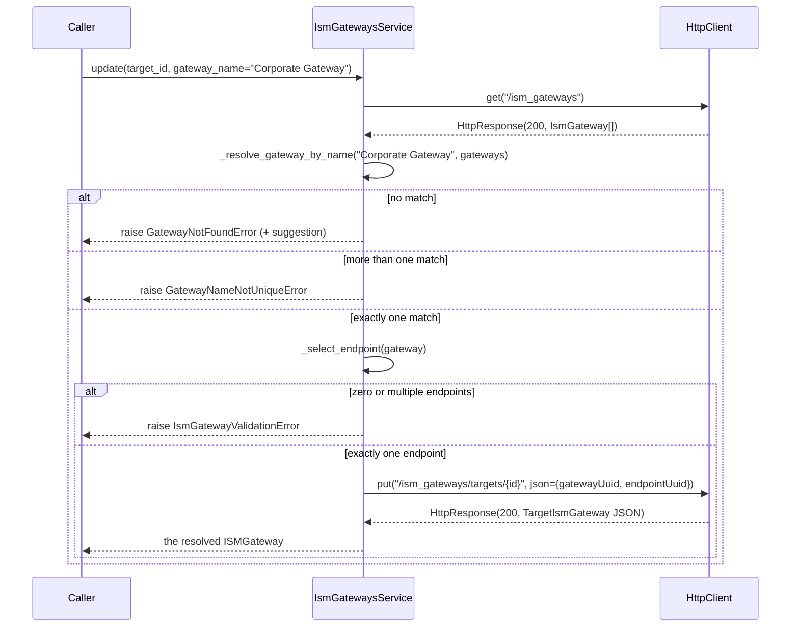
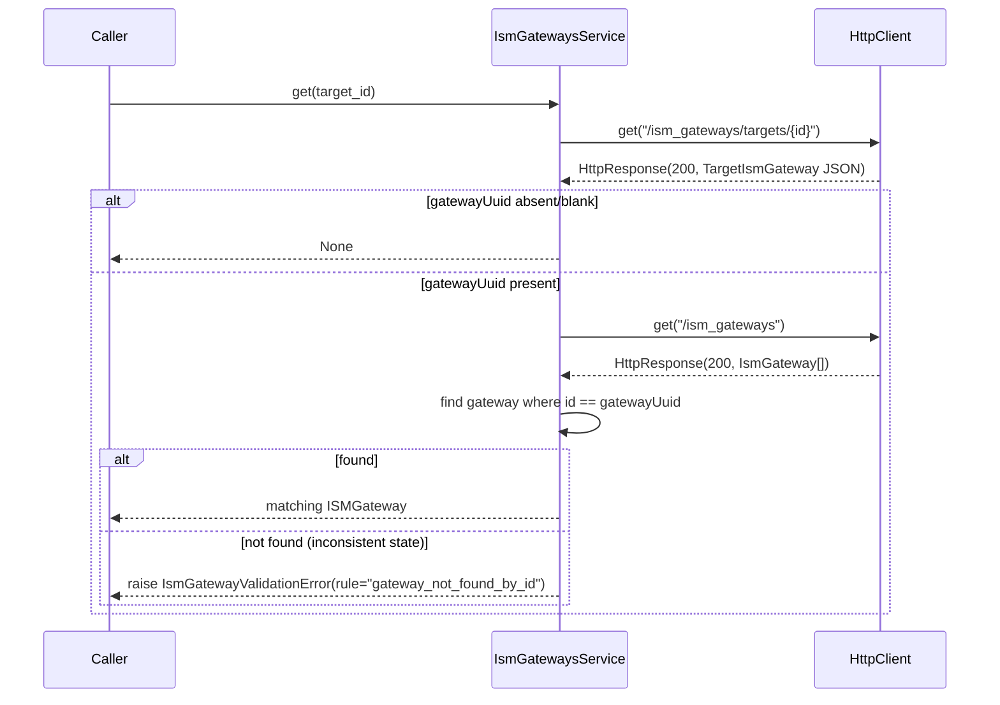
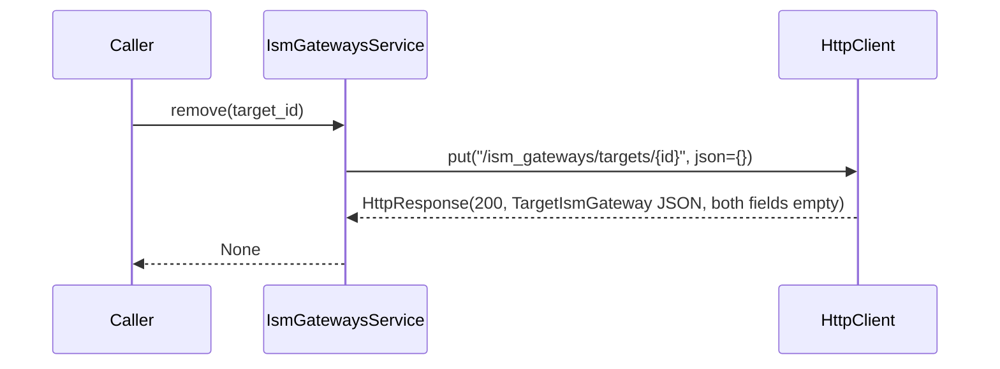

# Design — ISM Gateways

Implements [requirements.md](requirements.md), within the architecture and
conventions defined in [AGENTS.md](../../AGENTS.md). Extends
[Target Management](../target-management/design.md) (reuses its base-URL
constant, same pattern as
[API Specification Management](../api-specification-management/design.md))
and the configuration pipeline first built by
[Scanner Profiles](../scanners-profiles/design.md)
(`utils/sdk_config.py`).

---

## 1. Overview

ISM Gateways is architecturally two things in one small service:

1. A **thin CRUD-style read/write** over `/ism_gateways/targets/{target_id}`
   — the same one-call, one-log-line shape as
   `ApiSpecificationsService.get()`.
2. A **name resolver** that turns a human-readable `gateway_name` into the
   two identifiers (`gatewayUuid`, `endpointUuid`) the REST API actually
   requires — this is the part of the feature with real complexity, and
   the part requirements.md §1 spends most of its space reconciling
   against README's simpler mental model.

```
SDK Configuration or gateway_name        (ism-gateway.json, or a plain string)
      ↓
Configuration Loader                      load_json_config()  (reused, §3.3)
      ↓
Configuration Validator                   structure checks (§4.4)
      ↓
Gateway Resolver                          name → ISMGateway → ISMEndpoint  (§5)
      ↓
Configuration Transformer                 {gatewayUuid, endpointUuid}  (§6)
      ↓
HttpClient                                PUT /ism_gateways/targets/{target_id}
      ↓
Veracode API
```

The task brief that commissioned this feature names each of these five
stages explicitly. Per the precedent set by
[Scanner Profiles](../scanners-profiles/design.md#2-architecture), they
are implemented as small, plain functions — not one class per stage. A
class per stage would add indirection with no behavior gained; this
feature already has three genuinely distinct failure modes to keep
separate (structural validation, name-not-found, name-ambiguous), and
that separation is expressed by which function/exception fires, not by
which class an object belongs to.

## 2. Architecture

No new layer, no change to `HttpClient` — one service and its models on
top of the existing stack (AGENTS.md §3):

```
VeracodeClient
      ↓
  HTTP Client              (reused, unmodified)
      ↓
IsmGatewaysService          ← THIS FEATURE
      ↓
ISMGateway, ISMEndpoint     (models)
      ↓
  REST API  (DAST Target Configuration Service, same base URL as Targets)
```

`IsmGatewaysService` is a sibling of `ApiSpecificationsService`, not of
`ScannersService`/`ScannerVariablesService`: all three of the former group
are addressed by `target_id`; the latter two are addressed by
`analysis_profile_id`. See requirements.md §1.1 for why.

## 3. Components and Interfaces

### 3.1 `src/veracode_dast/models/ism_gateway.py`

```python
from __future__ import annotations

from dataclasses import dataclass, field
from typing import Any


@dataclass(frozen=True)
class ISMEndpoint:
    """One internal scanning endpoint under an ISM gateway.

    Field names mirror the OpenAPI `IsmEndpoint` schema exactly (`token`
    is kept as-is, not renamed to `id`) because the OpenAPI never
    documents what `token` actually represents (requirements.md §1.3) —
    renaming it to something more confident-sounding than the source
    schema would overstate what is actually known.
    """

    token: str
    name: str | None = None
    status: str | None = None

    @classmethod
    def from_api(cls, data: dict[str, Any]) -> ISMEndpoint:
        return cls(token=data["token"], name=data.get("name"), status=data.get("status"))


@dataclass(frozen=True)
class ISMGateway:
    """An ISM gateway available to the account, or assigned to a target.

    Named `ISMGateway` (not `IsmGateway`) to match README's literal
    spelling verbatim — see requirements.md §1.6.
    """

    id: str
    name: str
    status: str | None = None
    hostname: str | None = None
    endpoints: list[ISMEndpoint] = field(default_factory=list)

    @classmethod
    def from_api(cls, data: dict[str, Any]) -> ISMGateway:
        """Maps the OpenAPI's `refId` to `id` (requirements.md §0.2)."""
        return cls(
            id=data["refId"],
            name=data["name"],
            status=data.get("status"),
            hostname=data.get("hostname"),
            endpoints=[ISMEndpoint.from_api(e) for e in data.get("endpoints", [])],
        )
```

No model is defined for `TargetIsmGateway` (requirements.md §7.4) — it is
built and read as a plain `dict[str, Any]` entirely inside
`services/ism_gateways.py` (§6), never exposed to a caller.

### 3.2 `src/veracode_dast/exceptions.py` (extended)

```python
class IsmGatewayValidationError(VeracodeSDKError):
    """Raised for SDK-level ISM Gateway parameter/configuration validation
    failures (requirements.md §6.1).

    Attributes:
        rule: A short identifier of which validation rule failed.
    """

    def __init__(self, message: str, *, rule: str) -> None:
        self.rule = rule
        super().__init__(message)


class GatewayNotFoundError(VeracodeSDKError):
    """Raised when no available ISM Gateway matches a requested name
    (requirements.md §6.2). Named to match README's exact exception name,
    not prefixed `IsmGateway` (requirements.md §1.5).

    Attributes:
        name: The gateway name that did not match any available gateway.
        suggestion: The closest available gateway name, or None if no
            close match was found.
    """

    def __init__(self, name: str, *, suggestion: str | None = None) -> None:
        self.name = name
        self.suggestion = suggestion
        message = f"ISM Gateway '{name}' was not found."
        if suggestion:
            message += f"\n\nDid you mean '{suggestion}'?"
        super().__init__(message)


class GatewayNameNotUniqueError(VeracodeSDKError):
    """Raised when more than one available ISM Gateway shares the
    requested name (requirements.md §6.3, README "Duplicate gateway
    names").

    Attributes:
        name: The ambiguous gateway name.
        matches: The `id` of every gateway that matched.
    """

    def __init__(self, name: str, *, matches: list[str]) -> None:
        self.name = name
        self.matches = matches
        super().__init__(
            f"Multiple ISM Gateways are named '{name}'; cannot resolve unambiguously."
        )
```

All three subclass `VeracodeSDKError` directly, never `VeracodeApiError`
— the same convention established by `TargetValidationError`/
`TargetNotFoundError` and every sibling feature since. `GatewayNotFoundError`
and `GatewayNameNotUniqueError` are a distinct pair rather than one
generic `IsmGatewayValidationError(rule=...)`, because they carry
structured data (`suggestion`, `matches`) a caller may want to handle
programmatically, and because README documents "not found" and
"duplicate" as conceptually different outcomes with different messages —
the same justification
[specs/scanners-profiles design §3.2](../scanners-profiles/design.md#32-srcveracode_dastexceptionspy-extended)
gives for a standalone `UnknownScannerError`.

### 3.3 `src/veracode_dast/utils/sdk_config.py` (reused, unmodified)

This feature imports `load_json_config` and `suggest_closest` exactly as
[specs/scanners-profiles design §3.3](../scanners-profiles/design.md#33-srcveracode_dastutilssdk_configpy-new-shared)
defines them. If Scanner Profiles has not yet landed when this feature is
implemented, that module (and `ConfigFileNotFoundError`/
`ConfigFileInvalidError`) is created first, verbatim to that spec — this
feature does not fork a second copy (requirements.md §8.1).

### 3.4 The Gateway Resolver — `src/veracode_dast/services/ism_gateways.py` (module-level functions)

```python
def _resolve_gateway_by_name(name: str, gateways: list[ISMGateway]) -> ISMGateway:
    """Finds the gateway named exactly `name` among `gateways`.

    A pure function over already-fetched data — no HttpClient involved —
    so it is unit-testable directly against fixtures (requirements.md §5,
    §11.2).

    Raises:
        GatewayNotFoundError: If no gateway matches.
        GatewayNameNotUniqueError: If more than one gateway matches.
    """
    matches = [g for g in gateways if g.name == name]
    if not matches:
        suggestion = suggest_closest(name, [g.name for g in gateways])
        raise GatewayNotFoundError(name, suggestion=suggestion)
    if len(matches) > 1:
        raise GatewayNameNotUniqueError(name, matches=[g.id for g in matches])
    return matches[0]


def _select_endpoint(gateway: ISMGateway) -> ISMEndpoint:
    """Selects the sole endpoint of `gateway` (requirements.md §1.2).

    Raises:
        IsmGatewayValidationError: If `gateway` has zero or more than one
            endpoint — this feature never guesses among multiple.
    """
    if not gateway.endpoints:
        raise IsmGatewayValidationError(
            f"ISM Gateway '{gateway.name}' has no endpoints to assign.",
            rule="gateway_has_no_endpoint",
        )
    if len(gateway.endpoints) > 1:
        raise IsmGatewayValidationError(
            f"ISM Gateway '{gateway.name}' has more than one endpoint; "
            "this SDK cannot resolve which one to use.",
            rule="gateway_endpoint_ambiguous",
        )
    return gateway.endpoints[0]
```

Two functions, not one, per requirements.md §5.2: name resolution and
endpoint selection fail for unrelated reasons and raise unrelated
exception types, so collapsing them would force one function to juggle
three different error shapes.

### 3.5 The Configuration Transformer

```python
def _build_target_ism_gateway_payload(gateway: ISMGateway, endpoint: ISMEndpoint) -> dict[str, Any]:
    """Builds the `TargetIsmGateway` request body (requirements.md §4.3.10)."""
    return {"gatewayUuid": gateway.id, "endpointUuid": endpoint.token}
```

Kept as a one-line function, not a class, for the same reason
[specs/scanners-profiles design §7](../scanners-profiles/design.md#7-transformation-layer)
keeps its own transformation step a dict comprehension: a dedicated
`Transformer` class here would have exactly one call site and no
independent state.

### 3.6 The Configuration Validator

```python
def _extract_gateway_name_from_config(config: dict[str, Any]) -> str:
    """Validates SDK Configuration structure and returns the configured
    gateway name (requirements.md §6.4-6.6, README "SDK Configuration").

    Raises:
        IsmGatewayValidationError: On any structural violation.
    """
    if not isinstance(config, dict):
        raise IsmGatewayValidationError(
            "SDK Configuration must be a JSON object", rule="config_must_be_object"
        )
    gateway = config.get("gateway")
    if not isinstance(gateway, dict):
        raise IsmGatewayValidationError(
            "SDK Configuration must contain a 'gateway' object", rule="gateway_key_required"
        )
    name = gateway.get("name")
    if not isinstance(name, str) or not name.strip():
        raise IsmGatewayValidationError(
            "SDK Configuration's 'gateway.name' must be a non-blank string",
            rule="gateway_name_required",
        )
    return name
```

### 3.7 `src/veracode_dast/services/ism_gateways.py`

```python
from veracode_dast.services.targets import TARGET_CONFIGURATION_SERVICE_BASE_URL

_ISM_GATEWAYS_PATH = "/ism_gateways"
_TARGET_ISM_GATEWAY_PATH = "/ism_gateways/targets/{target_id}"

logger = logging.getLogger(__name__)


class IsmGatewaysService:
    """Manages ISM Gateway assignment for existing DAST Targets."""

    def __init__(self, http_client: HttpClient) -> None:
        self._http_client = http_client

    def list(self) -> list[ISMGateway]:
        response = self._http_client.get(_ISM_GATEWAYS_PATH)
        gateways = [ISMGateway.from_api(item) for item in response.data]  # type: ignore[union-attr]
        logger.info("Retrieved %d ISM gateway(s)", len(gateways))
        return gateways

    def get(self, target_id: str) -> ISMGateway | None:
        self._require_non_blank(target_id, rule="target_id_required")
        response = self._http_client.get(_TARGET_ISM_GATEWAY_PATH.format(target_id=target_id))
        data = response.data or {}
        gateway_uuid = data.get("gatewayUuid")  # type: ignore[union-attr]
        if not gateway_uuid:
            logger.info("No ISM gateway assigned to target %s", target_id)
            return None

        gateway = next((g for g in self.list() if g.id == gateway_uuid), None)
        if gateway is None:
            raise IsmGatewayValidationError(
                f"Target {target_id} references ISM gateway {gateway_uuid}, "
                "which no longer exists in this account's gateway list.",
                rule="gateway_not_found_by_id",
            )
        logger.info("Target %s is assigned ISM gateway %s", target_id, gateway.name)
        return gateway

    def update(
        self,
        target_id: str,
        *,
        gateway_name: str | None = None,
        config_file: str | Path | dict[str, Any] | None = None,
    ) -> ISMGateway:
        self._require_non_blank(target_id, rule="target_id_required")
        if (gateway_name is None) == (config_file is None):
            raise IsmGatewayValidationError(
                "Exactly one of gateway_name or config_file must be provided",
                rule="gateway_name_or_config_file_required",
            )

        if config_file is not None:
            config = load_json_config(config_file)
            gateway_name = _extract_gateway_name_from_config(config)

        gateway = _resolve_gateway_by_name(gateway_name, self.list())  # type: ignore[arg-type]
        endpoint = _select_endpoint(gateway)

        logger.info("Assigning ISM gateway %s to target %s", gateway.name, target_id)
        self._http_client.put(
            _TARGET_ISM_GATEWAY_PATH.format(target_id=target_id),
            json=_build_target_ism_gateway_payload(gateway, endpoint),
        )
        logger.info("Assigned ISM gateway %s to target %s", gateway.name, target_id)
        return gateway

    def remove(self, target_id: str) -> None:
        self._require_non_blank(target_id, rule="target_id_required")
        logger.info("Removing ISM gateway assignment from target %s", target_id)
        self._http_client.put(_TARGET_ISM_GATEWAY_PATH.format(target_id=target_id), json={})
        logger.info("Removed ISM gateway assignment from target %s", target_id)

    @staticmethod
    def _require_non_blank(value: str, *, rule: str) -> None:
        if not value or not value.strip():
            raise IsmGatewayValidationError("Value must not be blank", rule=rule)
```

`TARGET_CONFIGURATION_SERVICE_BASE_URL` is imported, not redefined — same
rule every Phase 2 feature has followed since Target Management. `get()`
calling `self.list()` internally (rather than a private, non-logging
variant) is a deliberate simplicity choice: `list()` is already a single,
cheap `GET` with its own useful log line, and `IsmGatewaysService` has no
state to avoid re-fetching for the sake of.

### 3.8 `src/veracode_dast/client.py` (extended)

```python
from veracode_dast.services.ism_gateways import IsmGatewaysService

# inside VeracodeClient.__init__, after self.api_specifications is set:
self.ism_gateways = IsmGatewaysService(tcs_http_client)
```

Reuses the same `tcs_http_client` instance already constructed for
`targets`/`api_specifications` — no new `HttpClient`, no new base URL.

## 4. Service Responsibilities

| Responsibility | Owner |
|---|---|
| HTTP transport, HMAC auth, retries, status→exception mapping | `HttpClient` (unchanged) |
| Loading SDK Configuration (file or dict) | `utils/sdk_config.load_json_config` (reused) |
| Structural validation (`gateway` key, non-blank `name`) | `_extract_gateway_name_from_config` |
| Gateway-name resolution + "did you mean" suggestion | `_resolve_gateway_by_name` + `utils/sdk_config.suggest_closest` (reused) |
| Endpoint selection | `_select_endpoint` |
| SDK Configuration/`gateway_name` → API request transformation | `_build_target_ism_gateway_payload` |
| Building typed models from API responses | `ISMGateway.from_api` / `ISMEndpoint.from_api` |
| Business-event logging | `IsmGatewaysService` |

## 5. Sequences

### 5.1 `update()` with `gateway_name=` — resolution then assignment



### 5.2 `get()` — reverse lookup from identifiers back to a name



### 5.3 `remove()` — empty-body `PUT`



## 6. REST ↔ SDK Mapping

| REST operation | SDK method | Request model | Response model |
|---|---|---|---|
| `GET /ism_gateways` | `IsmGatewaysService.list()` | — | `list[ISMGateway]` |
| `GET /ism_gateways/targets/{id}` | `IsmGatewaysService.get(target_id)` | path param only | `ISMGateway \| None` |
| `PUT /ism_gateways/targets/{id}` | `IsmGatewaysService.update(target_id, ...)` | internal `dict` (`{gatewayUuid, endpointUuid}`) | `ISMGateway` |
| `PUT /ism_gateways/targets/{id}` (empty body) | `IsmGatewaysService.remove(target_id)` | internal `dict` (`{}`) | `None` |

`get()` composes two REST calls (`GET .../targets/{id}` then `GET
/ism_gateways`) because `TargetIsmGateway` carries no human-readable data
to build an `ISMGateway` from directly (requirements.md §0.2). `update()`
composes the same `GET /ism_gateways` (for resolution) with one `PUT`.

## 7. Data Model

| Type | Field | Notes |
|---|---|---|
| `ISMGateway` | `id`, `name`, `status`, `hostname`, `endpoints` | `id` ← OpenAPI `refId`. Mirrors `IsmGateway` (requirements.md §0.2). Name kept as README spells it (§1.6). |
| `ISMEndpoint` | `token`, `name`, `status` | Mirrors `IsmEndpoint` (requirements.md §0.2); `token` not renamed (§3.1 above). |

No model for `TargetIsmGateway`, `Problem`, or `ProblemError`
(requirements.md §7.4–§7.5) — the request/response pair is a private
`dict[str, Any]`, and error detail stays inside the HTTP Client's
exception attributes.

## 8. Error Handling

| Condition | Exception | Raised by |
|---|---|---|
| Blank `target_id` | `IsmGatewayValidationError(rule="target_id_required")` | `IsmGatewaysService` |
| Neither/both `gateway_name` and `config_file` supplied | `IsmGatewayValidationError(rule="gateway_name_or_config_file_required")` | `IsmGatewaysService.update` |
| Config is not an object / missing `gateway` object / blank `name` | `IsmGatewayValidationError` | `_extract_gateway_name_from_config` |
| `config_file` path missing / invalid JSON | `ConfigFileNotFoundError` / `ConfigFileInvalidError` | `utils.sdk_config.load_json_config` (reused) |
| No gateway matches the requested name | `GatewayNotFoundError` | `_resolve_gateway_by_name` |
| More than one gateway matches the requested name | `GatewayNameNotUniqueError` | `_resolve_gateway_by_name` |
| Resolved gateway has zero or multiple endpoints | `IsmGatewayValidationError` (`gateway_has_no_endpoint` / `gateway_endpoint_ambiguous`) | `_select_endpoint` |
| `get()`'s `gatewayUuid` matches no gateway in `list()` | `IsmGatewayValidationError(rule="gateway_not_found_by_id")` | `IsmGatewaysService.get` |
| HTTP 401 | `VeracodeAuthenticationError` | `HttpClient` (unchanged) |
| HTTP 403 | `VeracodeAuthorizationError` | `HttpClient` (unchanged) |
| HTTP 404 (`update`/`remove`, unknown `target_id`) | `VeracodeNotFoundError` | `HttpClient` (unchanged) |
| HTTP 500 | `VeracodeApiError` | `HttpClient` (unchanged) |

Every client-side check raises before any HTTP call except
`gateway_not_found_by_id`, which is discovered only after two successful
GET calls (requirements.md §4.2.5) — the same "post-success, not
pre-flight" category `TargetNotFoundError` occupies in Target Management.

## 9. Logging

- `services/ism_gateways.py` gets its logger via
  `logging.getLogger(__name__)`.
- `INFO` after `list()`: `"Retrieved %d ISM gateway(s)"`.
- `INFO` after `get()`: `"Target %s is assigned ISM gateway %s"` or
  `"No ISM gateway assigned to target %s"`.
- `INFO` before and after `update()`: `"Assigning ISM gateway %s to
  target %s"` / `"Assigned ISM gateway %s to target %s"`.
- `INFO` before and after `remove()`: `"Removing ISM gateway assignment
  from target %s"` / `"Removed ISM gateway assignment from target %s"`.
- No log statement ever includes `ISMEndpoint.token` (requirements.md
  §9.5) — only `target_id` and gateway `name` appear in any log record
  this feature produces.
- No request/response-level logging is added here — already covered by
  `HttpClient`.

## 10. Security Considerations

- `IsmGatewaysService` never touches credentials or the `auth` object
  directly — it only holds an already-constructed `HttpClient`.
- `IsmEndpoint.token` is treated as potentially credential-like, purely
  because of its name and the OpenAPI's lack of a description
  (requirements.md §1.3) — it is never logged (§9) and is not echoed back
  in any exception message.
- Exception messages (`GatewayNotFoundError`, `GatewayNameNotUniqueError`,
  `IsmGatewayValidationError`) only ever include gateway *names* and
  *ids*, never a `token` value.

## 11. Testing Strategy

Location: `tests/models/test_ism_gateway.py`,
`tests/services/test_ism_gateways.py`. Same stub-`HttpClient` approach as
every prior feature — no mocking library, no real sockets.

Cases to cover:

- `ISMGateway.from_api` / `ISMEndpoint.from_api`: field-name mapping
  (`refId` → `id`) round-trips against a fixture shaped like
  requirements.md §0.2; `ISMGateway(id=..., name=..., status=...)`
  constructs without `hostname`/`endpoints` (README compatibility, §3.1
  above).
- `_resolve_gateway_by_name`: exact match; zero matches →
  `GatewayNotFoundError` (with and without a close-match suggestion);
  more than one match → `GatewayNameNotUniqueError` carrying every
  matched `id`.
- `_select_endpoint`: exactly one endpoint → selected; zero → validation
  error `gateway_has_no_endpoint`; two or more → validation error
  `gateway_endpoint_ambiguous`.
- `_extract_gateway_name_from_config`: valid `{"gateway": {"name": ...}}`
  → extracted name; non-dict config, missing `gateway` key, blank `name`
  → each their own `IsmGatewayValidationError(rule=...)`.
- `IsmGatewaysService.list()`: 200 → `list[ISMGateway]` matching fixture
  count/order.
- `IsmGatewaysService.get()`: blank `target_id` → validation error, no
  HTTP call; unassigned target (`gatewayUuid` absent) → `None`; assigned
  target → matching `ISMGateway`, asserting exactly two stub calls were
  made (`get` then `list`'s `get`); `gatewayUuid` with no `list()` match →
  `IsmGatewayValidationError(rule="gateway_not_found_by_id")`.
- `IsmGatewaysService.update()`: blank `target_id` → validation error, no
  HTTP call; neither/both `gateway_name`/`config_file` → validation
  error, no HTTP call; the README "SDK Configuration Format" fixture via
  `config_file` (both a `tmp_path` JSON file and an equivalent in-memory
  dict) → identical `PUT` body to the direct `gateway_name=` call;
  unresolvable name/ambiguous name/endpoint-count failures → no `put`
  call made on the stub in any of them; 404 → `VeracodeNotFoundError`
  propagates.
- `IsmGatewaysService.remove()`: blank `target_id` → validation error, no
  HTTP call; 200 → `None`; asserts the stub's `put` was called with
  `json={}`; 404 → `VeracodeNotFoundError` propagates.
- `caplog` assertion: no captured log record from this feature contains
  any `token` value used in a test fixture.

## 12. File Layout Introduced by This Feature

```
src/veracode_dast/
├── models/ism_gateway.py         # ISMEndpoint, ISMGateway
├── services/ism_gateways.py      # IsmGatewaysService, Gateway Resolver
│                                 # functions, Configuration Validator/
│                                 # Transformer functions
├── utils/sdk_config.py           # (reused, unmodified — created by
│                                 # Scanner Profiles if not already present)
├── client.py                     # (+) self.ism_gateways, sharing
│                                 # client.targets' HttpClient
└── exceptions.py                 # (+) IsmGatewayValidationError,
                                   #     GatewayNotFoundError,
                                   #     GatewayNameNotUniqueError

tests/
├── models/test_ism_gateway.py
└── services/test_ism_gateways.py

examples/
└── ism_gateway_example.py

specs/ism-gateway/
└── ism-gateway.json              # sample SDK Configuration fixture,
                                   # mirrors the README
```

## 13. Traceability

| Component | Requirements covered |
|---|---|
| §1.1–§1.6 reconciliation decisions | requirements.md §1 |
| `ISMGateway`, `ISMEndpoint` | §7.1–§7.6 |
| `IsmGatewaysService.list` | §4.1.1–§4.1.3 |
| `IsmGatewaysService.get` | §4.2.1–§4.2.6 |
| `_resolve_gateway_by_name`, `_select_endpoint` (Gateway Resolver) | §5.1–§5.3, §4.3.5–§4.3.9 |
| `_extract_gateway_name_from_config` (Configuration Validator) | §6.4–§6.6, §4.3.4 |
| `_build_target_ism_gateway_payload` (Configuration Transformer) | §4.3.10 |
| `IsmGatewaysService.update` | §4.3.1–§4.3.12 |
| `IsmGatewaysService.remove` | §4.4.1–§4.4.4 |
| `IsmGatewayValidationError`, `GatewayNotFoundError`, `GatewayNameNotUniqueError` | §6.1–§6.3 |
| Logging (§9) | §9.1–§9.6 |
| Public interface, `HttpClient` reuse | §10.1–§10.4 |
| Testing strategy (§11) | §11.1–§11.3 |

## 14. Architecture Decisions

Collected here for discoverability, per the pattern established by
[specs/target-management design §12](../target-management/design.md#12-architecture-decisions).

**Scoping identifier.**
- **Decision:** every public method takes `target_id`, not
  `analysis_profile_id`.
- **Rationale:** requirements.md §1.1 — no OpenAPI endpoint accepts an
  `analysis_profile_id` for this resource, and `AnalysisProfile.target_id`
  is optional (absent for `ORG`/`SYSTEM` profiles), so the concept doesn't
  generalize the way README implies.

**Endpoint auto-selection instead of exposing endpoints publicly.**
- **Decision:** `endpoints` stays on the `ISMGateway` model (data isn't
  discarded) but is never a caller-facing selection parameter; resolution
  auto-selects the sole endpoint or fails loudly.
- **Rationale:** requirements.md §1.2 — README's public surface has no
  concept of "endpoint" at all; inventing an `endpoint_name` parameter
  the README/task brief never described would be speculative scope
  creep. Failing loudly on ambiguity keeps the door open for that
  parameter later without having shipped silently-wrong behavior first.

**`token` as the endpoint identifier.**
- **Decision:** `IsmEndpoint.token` is sent as `TargetIsmGateway.endpointUuid`.
- **Rationale:** requirements.md §1.3 — the only plausible identifier
  field on an underspecified schema. Flagged, not asserted; gated on
  live-account validation (§15.1 below) before this feature ships.

**Empty-body `PUT` as `remove()`.**
- **Decision:** `remove()` sends `PUT .../targets/{id}` with `{}` rather
  than any other shape.
- **Rationale:** requirements.md §1.4 — no `DELETE` endpoint exists, and
  the `PUT`'s lack of a `method=PATCH`-style parameter (unlike Analysis
  Profile's) is read as ordinary full-replace semantics, under which an
  empty body clears both fields. Also gated on live-account validation.

**`GatewayNotFoundError`/`ISMGateway` naming exceptions.**
- **Decision:** these two class names deliberately break from this SDK's
  usual naming conventions (`<Resource>Error` prefixing;
  `Api`-not-`API`-style casing).
- **Rationale:** requirements.md §1.5–§1.6 — README fixes both names
  explicitly and literally; the same precedent
  `UnknownScannerError` already established for a README-fixed exception
  name is extended here to a model class name too.

## 15. Additional Architectural Recommendations (not implemented here)

1. **Live-account validation is a blocking precondition, not a
   follow-up.** Unlike ordinary "revisit if it proves slow" recommendations
   elsewhere in this SDK's specs, requirements.md §14.7 marks §1.3
   (`token` as identifier) and §1.4 (empty-body `PUT` as remove) as
   required validation against a real or sandbox Veracode account
   *before* `update()`/`remove()` ship — get a real account's
   `GET /ism_gateways` and a real `PUT .../targets/{id}` response to
   confirm both readings, or adjust `_select_endpoint`/`remove()`
   accordingly. Both are isolated to small, specific functions
   (§3.4, §3.7's `remove`), so a wrong guess is cheap to fix.
2. **Endpoint selection by name (`endpoint_name=` parameter)** is a
   natural extension if a real account ever surfaces a gateway with more
   than one endpoint in practice. Not built now — no consumer need
   identified, and README/the task brief describe no such parameter
   (requirements.md §14.1).
3. **`get()`'s double round-trip** (`GET .../targets/{id}` then
   `GET /ism_gateways`) could be optimized with a short-lived cache of
   `list()` within one `update()`/`get()` call, but not across calls
   (would violate the Stateless principle, AGENTS.md §5). Not built now —
   two cheap `GET`s is not a demonstrated performance problem, and adding
   a cache invalidation story for a two-call sequence is complexity this
   feature doesn't need yet.
