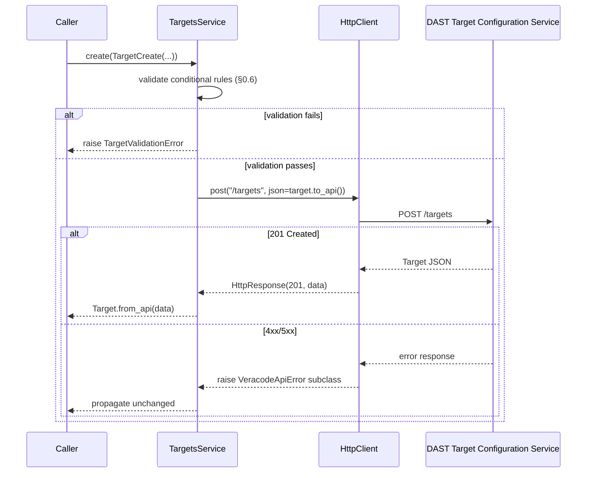
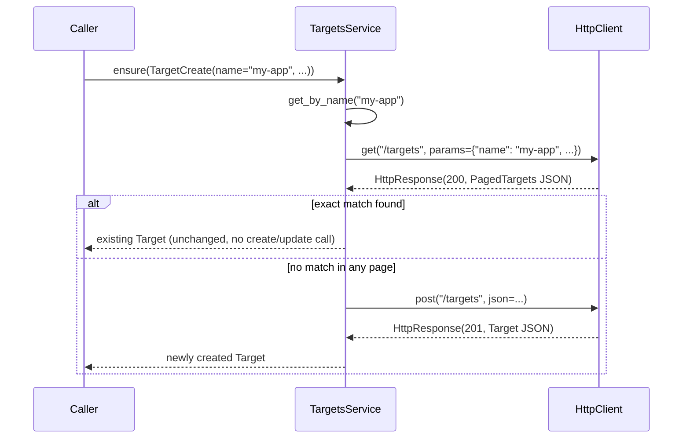
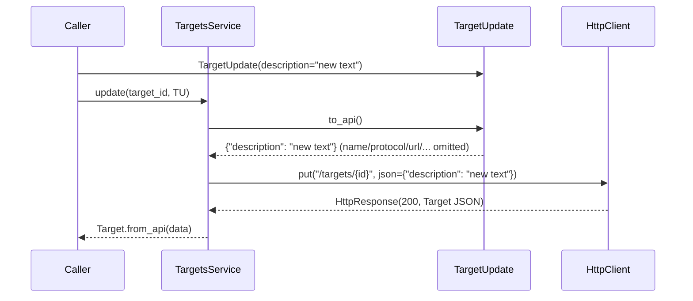
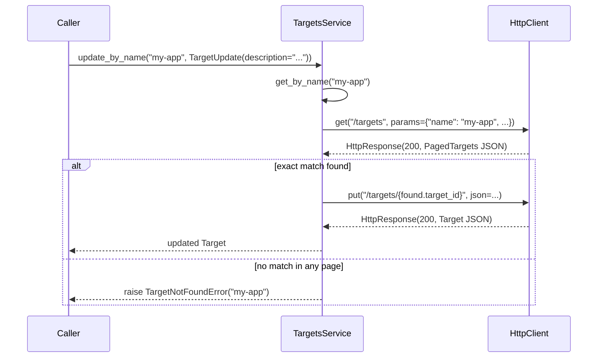

# Design — Target Management

Implements the requirements in [requirements.md](requirements.md), within
the architecture and conventions defined in [AGENTS.md](../../AGENTS.md).
Consumes [specs/http-client](../http-client/design.md) (`HttpClient`,
`HttpResponse`, the `VeracodeApiError` hierarchy) and
[specs/authentication](../authentication/design.md) (`get_veracode_auth`)
without modifying either.

---

## 1. Overview

This feature builds the first **Service** and the first real
`VeracodeClient` wiring in the SDK's layered architecture:

```
VeracodeClient      ← THIS FEATURE (client.py: wires client.targets)
      ↓
  HTTP Client        ← already built (specs/http-client)
      ↓
   Services          ← THIS FEATURE (services/targets.py: TargetsService)
      ↓
    Models           ← THIS FEATURE (models/target.py)
      ↓
  REST API           ← DAST Target Configuration Service
```

`TargetsService` depends only on an injected `HttpClient` instance — it
never imports `requests`, `auth.py`, or `config.py`. It translates typed
Python calls (`create(TargetCreate(...))`) into REST calls (`POST
/targets` with a JSON body) and REST responses back into typed models
(`Target`). Every REST-level failure is left to propagate as whichever
`VeracodeApiError` subclass the HTTP Client already raised (per
[specs/http-client design §2.1](../http-client/design.md#21-srcveracode_dastexceptionspy));
this feature adds exactly two new exceptions, `TargetValidationError` and
`TargetNotFoundError` (§2.2), for scenarios that are not simply a
translated HTTP error.

**REST-backed vs. SDK convenience.** Five `TargetsService` methods map
1:1 onto REST operations; four are pure compositions with no new
endpoint:

| Method | Backing |
|---|---|
| `list`, `get`, `create`, `update`, `delete` | Directly backed by one REST call each (§3). |
| `get_by_name`, `exists`, `ensure` | SDK convenience — composed entirely from `list`/`create`. |
| `update_by_name` | SDK convenience — composed entirely from `list`/`update` (via `get_by_name`), per requirements.md §4.6. |

---

## 2. Components and Interfaces

### 2.1 `src/veracode_dast/models/target.py`

```python
class TargetType(str, Enum):
    """Target type: web application or REST API."""
    WEB_APP = "WEB_APP"
    API = "API"


class ScanType(str, Enum):
    """Target scan type."""
    QUICK = "QUICK"
    FULL = "FULL"
    ENTERPRISE = "ENTERPRISE"


class Protocol(str, Enum):
    """Protocol used to reach a target."""
    HTTP = "HTTP"
    HTTPS = "HTTPS"


class TargetSortBy(str, Enum):
    """Fields `GET /targets` can sort by."""
    NAME = "name"
    URL = "url"
    TARGET_TYPE = "target_type"
    LAST_SCAN = "last_scan"
    STATUS = "status"
    MAX_CVSS = "max_cvss"


class SortOrder(str, Enum):
    """Sort direction for `GET /targets`."""
    ASC = "asc"
    DESC = "desc"


class TargetStatus(str, Enum):
    """Status of a target's most recent analysis run."""
    RUNNING = "RUNNING"
    STOPPING = "STOPPING"
    STOPPED = "STOPPED"
    FINISHED = "FINISHED"
    FAILED = "FAILED"


@dataclass(frozen=True)
class Target:
    """A Veracode DAST target, as returned by the REST API.

    Attributes mirror the OpenAPI `Target` schema (specs/target-management/
    requirements.md §0.4). Optional fields default to `None` when the API
    omits them.
    """

    target_id: str
    name: str
    protocol: Protocol
    url: str
    target_type: TargetType
    scan_type: ScanType
    is_sec_lead_only: bool
    teams: list[str]
    created_at: str
    updated_at: str
    api_specification_file_url: str | None = None
    description: str | None = None
    last_scan: str | None = None
    application_name: str | None = None
    application_uuid: str | None = None
    application_id: int | None = None
    max_cvss: float | None = None
    status: TargetStatus | None = None

    @classmethod
    def from_api(cls, data: dict[str, Any]) -> "Target": ...


@dataclass(frozen=True)
class TargetCreate:
    """Fields accepted by `POST /targets` (OpenAPI `TargetRequest`).

    Required fields have no default, matching the OpenAPI `required` list
    exactly — this class never supplies a value the caller didn't provide.
    """

    name: str
    url: str
    protocol: Protocol
    target_type: TargetType
    scan_type: ScanType
    authorized_to_scan: bool
    is_sec_lead_only: bool
    api_specification_file_url: str | None = None
    description: str | None = None
    teams: list[str] | None = None

    def to_api(self) -> dict[str, Any]: ...


_UNSET: Final = object()  # sentinel: field not mentioned by the caller


@dataclass(frozen=True)
class TargetUpdate:
    """Fields accepted by `PUT /targets/{target_id}` (OpenAPI
    `TargetUpdateRequest`) — every field optional, matching the REST
    contract (requirements.md §4.2).

    Fields default to an internal "unset" sentinel, not `None`, so the
    request body can distinguish "leave this field alone" (omitted
    entirely) from "clear this field" (explicit `None`, meaningful for the
    nullable `teams` field) — see requirements.md §4.3 and the rationale
    below.
    """

    name: str | None = _UNSET
    protocol: Protocol | None = _UNSET
    url: str | None = _UNSET
    api_specification_file_url: str | None = _UNSET
    description: str | None = _UNSET
    teams: list[str] | None = _UNSET

    def to_api(self) -> dict[str, Any]:
        """Return only the fields the caller explicitly set."""
        ...


@dataclass(frozen=True)
class TargetPage:
    """One page of `GET /targets` results (OpenAPI `PagedTargets`, minus
    `_links` — see requirements.md §1.5).
    """

    items: list[Target]
    page_number: int
    page_size: int
    total_pages: int
    total_elements: int

    @classmethod
    def from_api(cls, data: dict[str, Any]) -> "TargetPage": ...
```

**Why a sentinel instead of `Optional[X] = None` for `TargetUpdate`:** the
OpenAPI `teams` field is `nullable: true`, meaning `null` is a distinct,
meaningful value ("clear the team assignment") from the field being
absent from the JSON body ("don't touch teams"). A plain `None` default
cannot distinguish "the caller didn't mention `teams`" from "the caller
wants to set `teams` to null," so `to_api()` would either always send
every field (defeating partial update) or never be able to send an
explicit `null`. The sentinel is the smallest change that makes both
cases expressible; it is private to this module (`_UNSET`), never part of
the public API a caller constructs directly — `TargetUpdate(name="x")`
still reads like an ordinary dataclass call.

**Why `Target`, `TargetCreate`, `TargetUpdate`, `TargetPage` are frozen
dataclasses, not Pydantic/attrs models:** per [AGENTS.md
§3](../../AGENTS.md#3-architecture), models are "simple typed
representations," and the SDK's only other models
(`VeracodeCredentials`, `HttpResponse`) already use `@dataclass(frozen=
True)` — no new modeling dependency is introduced for this feature either.

### 2.2 `src/veracode_dast/exceptions.py` (extended)

```python
class TargetValidationError(VeracodeSDKError):
    """Raised when a Target request fails a client-side conditional check
    (requirements.md §0.6) before any HTTP call is made.

    Attributes:
        rule: Short machine-readable identifier for the violated rule
            (e.g. "api_specification_file_url_required_for_api_target").
    """

    def __init__(self, message: str, *, rule: str) -> None: ...


class TargetNotFoundError(VeracodeSDKError):
    """Raised by ``update_by_name`` when no target matches the given name
    (requirements.md §8.2, §10.10).

    Attributes:
        name: The target name that did not match any existing target.
    """

    def __init__(self, name: str) -> None: ...
```

Neither is a subclass of `VeracodeApiError` (from
[specs/http-client](../http-client/design.md#21-srcveracode_dastexceptionspy)):
`VeracodeApiError` and its subclasses always carry `method`/`url`/
`status_code` because they describe a REST call that was actually made.
`TargetValidationError` is raised strictly before any such call.
`TargetNotFoundError` is raised *after* a real `GET /targets` call, but
that call itself succeeded (200, zero matches) — there is no failed
request to attach `status_code`/`response_body` to, so reusing
`VeracodeNotFoundError` (which means "the server returned 404") would
misrepresent what happened. A caller that wants to catch "anything wrong
with this Target operation, REST or local" catches `VeracodeSDKError`,
the common root all three trees share.

**Naming convention for resource-specific business exceptions.** These
two classes establish the pattern this SDK uses whenever a feature needs
an exception for a scenario that is not simply a translated HTTP error:

1. Name it `<Resource><Reason>Error` (e.g. `TargetValidationError`,
   `TargetNotFoundError`) — prefixed by the owning resource, not generic.
2. Subclass `VeracodeSDKError` directly, never `VeracodeApiError` or one
   of its subclasses — those are reserved for failures that occurred
   *during* an HTTP request/response cycle. A resource-specific exception
   raised before a request is sent, or after a request that itself
   succeeded, is a different category of failure and must stay visibly
   separate from HTTP-transport errors.
3. Keep it feature-owned: only Target Management defines `Target*Error`
   classes. A future service (Target Configuration, Analysis Profiles,
   Scanner Configuration, ...) defines its own `<Resource>*Error` classes
   the same way, rather than reusing or generalizing these two.

This convention is not itself derived from AGENTS.md or the OpenAPI — it
is an architectural decision made for this feature and intended for reuse
by future resource-specific services (see design.md §12, "Exception
naming convention").

### 2.3 `src/veracode_dast/services/targets.py`

```python
TARGET_CONFIGURATION_SERVICE_BASE_URL: Final = (
    "https://api.veracode.com/dae/api/tcs-api/api/v1"
)
_BASE_PATH: Final = "/targets"


class TargetsService:
    """Veracode DAST Target Management.

    Every method translates directly to zero or more calls against the
    injected `HttpClient`. This class never imports `requests`, `auth.py`,
    or `config.py`, and holds no business-data state between calls.
    """

    def __init__(self, http_client: HttpClient) -> None:
        """Args:
            http_client: An `HttpClient` already configured with the DAST
                Target Configuration Service base URL
                (`TARGET_CONFIGURATION_SERVICE_BASE_URL`, defined in this
                module) and an auth provider. Constructed by
                `VeracodeClient` (§2.4) or supplied directly in tests —
                this class never constructs its own `HttpClient`.
        """
        self._http = http_client
        self._log = logging.getLogger(__name__)

    def list(
        self,
        *,
        page: int = 0,
        limit: int = 10,
        sort_by: TargetSortBy = TargetSortBy.NAME,
        sort_order: SortOrder = SortOrder.ASC,
        name: str | None = None,
        url: str | None = None,
        search_term: str | None = None,
        target_type: TargetType | None = None,
    ) -> TargetPage:
        """List targets. One call always maps to one `GET /targets`
        request; see requirements.md §1."""
        ...

    def get(self, target_id: str) -> Target:
        """`GET /targets/{target_id}`. Raises `VeracodeNotFoundError` if
        unknown (requirements.md §2)."""
        ...

    def create(self, target: TargetCreate) -> Target:
        """`POST /targets`, after the client-side checks in
        requirements.md §3.5–3.7."""
        ...

    def update(self, target_id: str, target: TargetUpdate) -> Target:
        """`PUT /targets/{target_id}`, sending only fields explicitly set
        on `target` (requirements.md §4)."""
        ...

    def delete(self, target_id: str) -> None:
        """`DELETE /targets/{target_id}` (requirements.md §5)."""
        ...

    def get_by_name(self, name: str) -> Target | None:
        """SDK convenience: exact-name lookup composed from `list`
        (requirements.md §10.1–10.3)."""
        ...

    def exists(self, name: str) -> bool:
        """SDK convenience: `get_by_name(name) is not None`
        (requirements.md §10.4)."""
        ...

    def ensure(self, target: TargetCreate) -> Target:
        """SDK convenience: return the existing target named
        `target.name`, or create it if none exists
        (requirements.md §10.5–10.6). Never updates an existing target."""
        ...

    def update_by_name(self, name: str, target: TargetUpdate) -> Target:
        """SDK convenience: resolve `name` to a `target_id` via
        `get_by_name`, then `update` it (requirements.md §10.8–10.11).

        Raises:
            TargetNotFoundError: If no target named `name` exists.
        """
        ...
```

### 2.4 `src/veracode_dast/client.py` (extended)

```python
from veracode_dast.services.targets import (
    TARGET_CONFIGURATION_SERVICE_BASE_URL,
    TargetsService,
)


class VeracodeClient:
    """Public SDK entry point. Owns configuration and exposes one Service
    per Veracode resource as an attribute, e.g. `client.targets`.
    """

    def __init__(self) -> None:
        """Reads `VERACODE_API_KEY_ID`/`VERACODE_API_KEY_SECRET` from the
        environment (via `get_veracode_auth()`) and constructs every
        Service's `HttpClient` with the base URL that Service's Veracode
        API requires.

        Raises:
            MissingCredentialsError: If required environment variables are
                missing or empty (propagated from `get_veracode_auth()`).
        """
        auth = get_veracode_auth()
        self.targets = TargetsService(
            HttpClient(base_url=TARGET_CONFIGURATION_SERVICE_BASE_URL, auth=auth)
        )
```

This is the first feature to give `VeracodeClient` a body — both prior
features deliberately left it unbuilt (per [specs/http-client design
§1](../http-client/design.md#1-overview)). Per [AGENTS.md
§3.1](../../AGENTS.md#31-authentication-is-base-url-agnostic), "adding a
new Veracode API base URL is a change to a service, never to `auth.py` or
`client.py`" — so the base URL **literal** is defined exactly once, in
`services/targets.py` (§2.3), not in `client.py`. `client.py` only
*imports* `TARGET_CONFIGURATION_SERVICE_BASE_URL`; it never redefines,
duplicates, or hardcodes a Veracode API base URL of its own. A future
service (e.g. Target Configuration, in Phase 2) follows the same pattern:
it exports its own base-URL constant from its own service module, and
`VeracodeClient.__init__` gains one additional import + wiring line —
`client.py`'s *existing* lines for `targets` are untouched.

---

## 3. Sequences

### 3.1 `create()` — REST-backed, with client-side validation



### 3.2 `ensure()` — SDK convenience composed from `list` + `create`



### 3.3 `update()` — partial body construction



### 3.4 `update_by_name()` — SDK convenience composed from `list` + `update`



---

## 4. REST ↔ SDK Mapping

| REST operation | SDK method | Request model | Response model |
|---|---|---|---|
| `GET /targets` | `TargetsService.list(...)` | query params only | `TargetPage` |
| `POST /targets` | `TargetsService.create(target)` | `TargetCreate` → `TargetRequest` | `Target` |
| `GET /targets/{id}` | `TargetsService.get(target_id)` | path param only | `Target` |
| `PUT /targets/{id}` | `TargetsService.update(target_id, target)` | `TargetUpdate` → `TargetUpdateRequest` | `Target` |
| `DELETE /targets/{id}` | `TargetsService.delete(target_id)` | path param only | `None` |
| *(none — composition)* | `TargetsService.get_by_name(name)` | — | `Target \| None` |
| *(none — composition)* | `TargetsService.exists(name)` | — | `bool` |
| *(none — composition, uses `GET`+`POST`)* | `TargetsService.ensure(target)` | `TargetCreate` | `Target` |
| *(none — composition, uses `GET`+`PUT`)* | `TargetsService.update_by_name(name, target)` | `TargetUpdate` | `Target` (raises `TargetNotFoundError` if no match) |

---

## 5. Data Model

| Type | Field | Notes |
|---|---|---|
| `Target` | all fields | See §2.1; mirrors OpenAPI `Target` (requirements.md §0.4). |
| `TargetCreate` | all fields | Mirrors OpenAPI `TargetRequest`; required fields have no default. |
| `TargetUpdate` | all fields | Mirrors OpenAPI `TargetUpdateRequest`; all fields default to the `_UNSET` sentinel. |
| `TargetPage` | `items`, `page_number`, `page_size`, `total_pages`, `total_elements` | Mirrors `PagedTargets` minus `_links` (requirements.md §1.5). |
| `TargetType`, `ScanType`, `Protocol`, `TargetSortBy`, `SortOrder`, `TargetStatus` | — | `str` enums (requirements.md §6). |

No model for `Problem`, `ProblemError`, or `Link` is introduced
(requirements.md §6.9) — error detail stays inside the HTTP Client's
exception attributes (`response_body`, per [specs/http-client design
§4](../http-client/design.md#4-error-handling)).

---

## 6. Error Handling

| Condition | Exception | Raised by |
|---|---|---|
| `target_type == API` and `api_specification_file_url` missing | `TargetValidationError` | `TargetsService.create` (before any HTTP call) |
| `is_sec_lead_only`/`teams` conflict | `TargetValidationError` | `TargetsService.create` |
| `teams` has more than 1 entry | `TargetValidationError` | `TargetsService.create`, `TargetsService.update` |
| No target matches `name` | `TargetNotFoundError` | `TargetsService.update_by_name` (after a successful, zero-match `GET /targets`) |
| 401 | `VeracodeAuthenticationError` | `HttpClient` (unmodified) |
| 403 | `VeracodeAuthorizationError` | `HttpClient` (unmodified) |
| 404 (`get`, `delete`) | `VeracodeNotFoundError` | `HttpClient` (unmodified) |
| 400/501/other 4xx/5xx | `VeracodeApiError` | `HttpClient` (unmodified) |
| Connection error / timeout | `VeracodeConnectionError` / `VeracodeTimeoutError` | `HttpClient` (unmodified) |

`TargetsService` contains no `try`/`except` around any `HttpClient` call
— every REST-level exception already carries everything a caller needs
(`method`, `url`, `status_code`, `response_body`); wrapping it would only
obscure the original type without adding information (requirements.md
§8.2–8.3).

---

## 7. Logging

- `services/targets.py` gets its logger via `logging.getLogger(__name__)`
  — same convention as every other module.
- `INFO` after a successful `create`: `"Created target %s (%s)"`,
  `target_id`, `name`.
- `INFO` after a successful `update`: `"Updated target %s"`, `target_id`.
- `INFO` after a successful `delete`: `"Deleted target %s"`, `target_id`.
- `INFO` when `ensure` creates a new target: `"ensure: no target named %s
  found, created %s"`, `name`, `target_id` — distinct message from the
  plain `create` log so a reader of the logs can tell the two call sites
  apart (requirements.md §9.2).
- `INFO` when `ensure` finds an existing target: `"ensure: target named %s
  already exists (%s)"`, `name`, `target_id`.
- `update_by_name` adds no logging of its own beyond what the `update` it
  calls internally already emits on success; the `TargetNotFoundError`
  path is not logged separately — the raised exception is the signal,
  matching how `MissingCredentialsError` (authentication feature) needs
  no accompanying log statement.
- No log statement includes `url`, `description`, `teams`, or any other
  field beyond `target_id`/`name` (requirements.md §9.3).
- No request/response-level logging is added here — that is already
  covered by `HttpClient` (requirements.md §9.4).

---

## 8. Security Considerations

- `TargetsService` never touches credentials, environment variables, or
  the `auth` object directly — it only holds an already-constructed
  `HttpClient`.
- Target business data (`url`, `description`, `teams`) is treated as
  potentially sensitive per [AGENTS.md §6.2](../../AGENTS.md#62-business-data)
  and is excluded from all logging (§7), even at `INFO` level.
- `TargetValidationError` messages describe which rule failed (e.g. "teams
  must be empty when is_sec_lead_only is true") without echoing the
  caller's actual `url`/`description` values, keeping error output as safe
  to display/log as the exceptions from `specs/http-client`.

---

## 9. Testing Strategy

Location: `tests/services/test_targets.py`,
`tests/models/test_target.py`.

No new test dependency — `HttpClient` is replaced with a stub/fake
exposing `get`/`post`/`put`/`delete` methods that return pre-built
`HttpResponse` values (or raise a pre-built `VeracodeApiError` subclass),
matching the pattern already used by [specs/http-client testing
strategy](../http-client/design.md#7-testing-strategy). No real network
access, environment variables, or Veracode credentials are needed.

Cases to cover:

- `list()`: default query parameters match §0.3's defaults; every
  supplied filter/sort/pagination argument is forwarded; `TargetPage` is
  built correctly from a `PagedTargets`-shaped fixture, `_links` is not
  exposed anywhere on the result.
- `get()`: 200 → `Target.from_api` fixture round-trip; 404 →
  `VeracodeNotFoundError` propagates unchanged (stub raises it, service
  doesn't catch it).
- `create()`: valid `TargetCreate` → correct `POST` body and `Target`
  returned from a 201 fixture; each of the three conditional-validation
  cases (API target missing spec URL, sec-lead/teams conflict, >1 team)
  raises `TargetValidationError` with no call made to the stub
  `HttpClient` (assert the stub's `post` was never called).
  A 400/501 response from the stub propagates as `VeracodeApiError`
  unchanged.
- `update()`: only explicitly-set fields appear in the `PUT` body (assert
  on the stub's captured `json` argument for a `TargetUpdate` that sets
  one field); explicit `teams=None` sends `"teams": null`; unset fields
  are absent from the payload entirely; `teams` with >1 entry raises
  `TargetValidationError` before any call.
- `delete()`: 204 → returns `None`; 404 → `VeracodeNotFoundError`
  propagates.
- `get_by_name()`: exact match on first page; exact match requiring a
  second page (10.2, via a stubbed multi-page sequence); no match across
  all pages → `None`; confirms no exception is raised for "not found."
- `exists()`: delegates to `get_by_name`, returns `True`/`False`.
- `ensure()`: existing target found → returned as-is, stub's `post` never
  called; no existing target → `create` is called and its result
  returned; confirms `ensure` never calls `update`.
- `update_by_name()`: match found → `update` is called with the matched
  `target_id` and the result is returned; no match → `TargetNotFoundError`
  is raised and the stub's `put` is never called.
- `Target`/`TargetCreate`/`TargetUpdate`/`TargetPage`: round-trip
  to/from a fixture dict matching the OpenAPI examples in
  requirements.md §0.4; confirm none of them import `requests` or
  `HttpClient`.

---

## 10. File Layout Introduced by This Feature

```
src/veracode_dast/
├── client.py                # + VeracodeClient (first real implementation)
├── exceptions.py            # + TargetValidationError, TargetNotFoundError
├── models/
│   └── target.py            # TargetType, ScanType, Protocol, TargetSortBy,
│                             # SortOrder, TargetStatus, Target, TargetCreate,
│                             # TargetUpdate, TargetPage
└── services/
    └── targets.py            # TargetsService

tests/
├── models/
│   └── test_target.py
└── services/
    └── test_targets.py

examples/
└── target_management_example.py   # VeracodeClient() then ensure/
                                    # update_by_name/delete, printing
                                    # typed results. Business data (name,
                                    # url, protocol, ...) comes from CLI
                                    # arguments (argparse), never
                                    # hardcoded or read from the
                                    # environment by the example itself.
```

**Why CLI arguments for the example, specifically:** per [AGENTS.md
§6.2](../../AGENTS.md#62-business-data) and requirements.md §11 (the SDK
never reads business data from the environment — only
`VeracodeClient()` reads infrastructure credentials that way), the
example must demonstrate the SDK consumer's responsibility for supplying
business data, not the SDK doing it implicitly. `argparse` is chosen
over a hardcoded dict or a config file because it mirrors how the example
will actually be invoked once an Azure DevOps pipeline template calls
this same script as a step — the template passes target properties as
command-line arguments to the Python script, exactly like a terminal
invocation:

```bash
python examples/target_management_example.py \
    --name mi-app-prod --url app.example.com --protocol HTTPS \
    --target-type WEB_APP --scan-type QUICK --teams 1
```

No config-file parser or environment-variable convention is introduced
for this — `argparse` is stdlib, requires no new dependency, and is
sufficient for Phase 1's one example script.

---

## 11. Traceability

| Component | Requirements covered |
|---|---|
| `models/target.py` enums | 6.1–6.6 |
| `Target`, `TargetCreate`, `TargetUpdate`, `TargetPage` | 6.7–6.9, requirements §0.4 |
| `TargetsService.list` | 1.1–1.6 |
| `TargetsService.get` | 2.1–2.3 |
| `TargetsService.create` + validation | 3.1–3.9, 7.1–7.3 |
| `TargetsService.update` + `TargetUpdate.to_api` | 4.1–4.5 |
| `TargetsService.delete` | 5.1–5.3 |
| `TargetValidationError`, `TargetNotFoundError` | 8.1–8.5 |
| Logging (§7) | 9.1–9.4 |
| `get_by_name`, `exists`, `ensure` | 10.1–10.7 |
| `TargetsService.update_by_name` | 4.6, 10.8–10.11 |
| No out-of-scope endpoints/resources; no direct `requests`/auth import | 11.1–11.5 |
| `TargetsService` public surface; `VeracodeClient` wiring | 12.1–12.5 |
| Testing strategy (§9) | 13.1–13.3 |

---

## 12. Architecture Decisions

This section collects the decisions in this feature that were made for
SDK usability rather than derived directly from the OpenAPI, README, or
AGENTS.md. Each requirement that traces back to one of these is tagged
inline in requirements.md with a pointer to the matching entry below,
per requirements.md §0's traceability rule ("nothing in §1–§13 introduces
a REST behavior not captured [in the OpenAPI review]" — these entries are
the documented exceptions to that rule: SDK-only behavior, not REST
behavior).

**Convenience methods.**
- **Decision:** provide `get_by_name`, `exists`, `ensure`, and
  `update_by_name` as SDK convenience methods, in addition to the five
  REST-backed CRUD operations. `get_by_name`'s implementation scans
  subsequent pages (requirements.md §10.2) rather than trusting the
  first page's `name` filter alone.
- **Rationale:** README explicitly allows convenience methods "such as"
  `get_by_name`/`exists`/`ensure` composing existing REST operations
  without new endpoints; `update_by_name` extends that same allowance
  (README's list is illustrative, not exhaustive — see requirements.md
  §12.1). Scanning multiple pages in `get_by_name` avoids assuming the
  OpenAPI's `name` filter is already an exact match, which the OpenAPI
  does not document either way — trusting only the first page could
  silently miss an existing target with the same name on a later page.

**`ensure()` behavior.**
- **Decision:** `ensure()` never reconciles drift between an existing
  target and the caller-supplied desired state — it is a pure
  get-or-create and never calls `update` (requirements.md §10.6).
- **Rationale:** "Ensure" is read narrowly as "guarantee a target with
  this name exists," not "guarantee it has these exact properties."
  Reconciling drift would require an undefined conflict policy (which
  fields win, whether to fail on mismatch) that neither README nor the
  OpenAPI specifies — inventing one would be scope creep beyond what was
  requested.

**`update_by_name()` behavior.**
- **Decision:** `update_by_name()` raises `TargetNotFoundError` — rather
  than returning `None` like `get_by_name`, or silently creating a new
  target — when no target matches (requirements.md §10.10).
- **Rationale:** `update` is an action verb, and the direct-ID `update()`
  already fails loudly (`VeracodeNotFoundError` from a 404) when the ID
  doesn't exist. `update_by_name` mirrors that fail-on-absence behavior
  for consistency. It cannot reuse `VeracodeNotFoundError` itself because
  no HTTP call failed to reach that conclusion (§2.2) — hence the
  dedicated exception, following the naming convention in §2.2.

**Pagination decisions.**
- **Decision:** `TargetPage` (§2.1) omits the OpenAPI's `_links` (HATEOAS
  navigation) array (requirements.md §1.5).
- **Rationale:** every navigation `_links` could express is already
  reachable by calling `list()` again with an incremented `page` — the
  caller already supplies every filter needed to do so. Exposing `_links`
  would mean maintaining a second, redundant navigation mechanism with no
  added capability.

**Target model decisions.**
- **Decision:** `TargetUpdate` (§2.1) defaults every field to a private
  `_UNSET` sentinel rather than `None`.
- **Rationale:** the OpenAPI's `teams` field is nullable — `null` is a
  distinct, meaningful value ("clear the team assignment") from the
  field being absent from the request body ("don't touch teams"). A
  plain `None` default cannot express both.
- **Decision:** the OpenAPI's `Status` schema is renamed to `TargetStatus`
  in the SDK (requirements.md §6.6); the enum's values are unchanged.
- **Rationale:** `Status` is a generic name; future Phase 2/3 resources
  (e.g. Analysis Runs, which have their own status concept) could
  otherwise collide with it. Prefixing by resource avoids that collision
  without changing any value the OpenAPI defines.

**Exception naming convention.**
- **Decision:** `TargetValidationError` and `TargetNotFoundError` follow
  a documented naming/subclassing convention (§2.2) intended for reuse by
  future resource-specific services.
- **Rationale:** see §2.2 for the full convention. Collected here so it
  is discoverable from this appendix without reading §2.2's exception
  definitions in full.

---

## 13. Additional Architectural Recommendations (not implemented here)

1. **`get_by_name`'s multi-page scan (§10.2) assumes the `name` filter
   narrows results enough that pages stay small.** If Veracode's `name`
   filter turns out to be a substring match returning many pages for a
   common name, this is still correct (bounded by `total_pages`) but
   could issue several requests. No pagination cap is added in this
   design — revisit only if this proves slow in practice against a real
   account.
2. **`ensure`'s no-drift-reconciliation behavior (§10.6)** is a
   deliberate scope decision, not a limitation to silently work around.
   If a future need for "create-or-update-to-match" emerges, it should be
   a new, separately named method (e.g. `sync`) with its own conflict
   policy — not a behavior change to `ensure`, which existing callers
   will rely on being a pure get-or-create.
