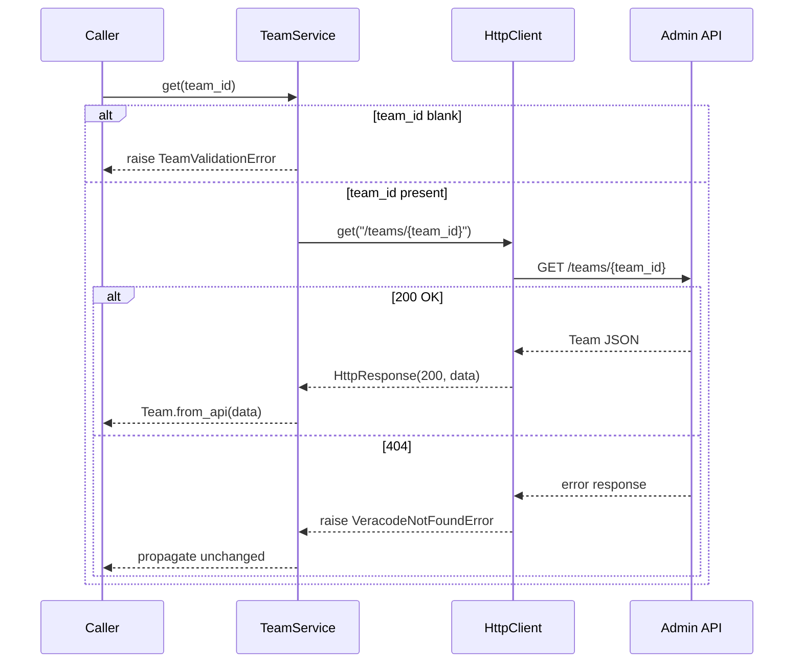
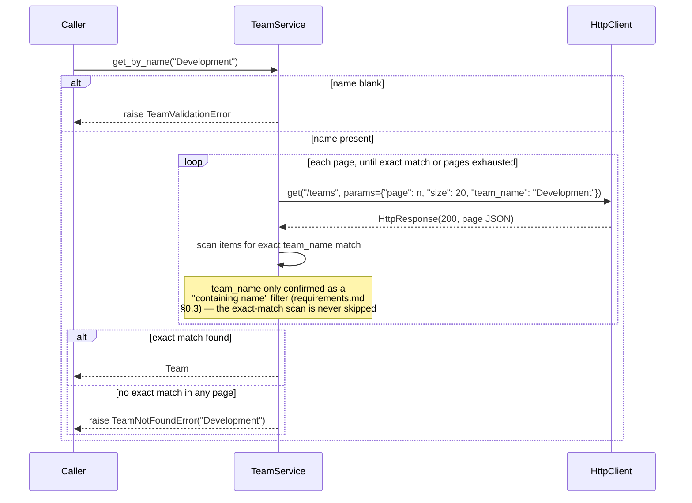
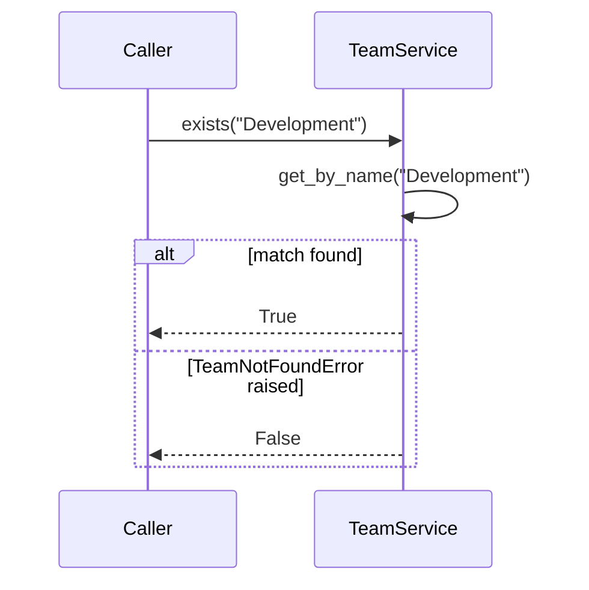

# Design — Team Management

Implements the requirements in [requirements.md](requirements.md), within
the architecture and conventions defined in [AGENTS.md](../../AGENTS.md).
Consumes [specs/http-client](../http-client/design.md) (`HttpClient`,
`HttpResponse`, the `VeracodeApiError` hierarchy) and
[specs/authentication](../authentication/design.md) (`get_veracode_auth`)
without modifying either. Reuses the exception-naming convention and
`VeracodeClient` wiring pattern established by
[specs/target-management design](../target-management/design.md), the
SDK's first Service — Team Management is the second, and the first
outside the DAST API domain.

---

## 1. Overview

This feature builds the SDK's second **Service**, extending
`VeracodeClient` with a second Veracode API base URL for the first time:

```
VeracodeClient      ← EXTENDED (client.py: adds client.teams alongside client.targets)
      ↓
  HTTP Client        ← already built (specs/http-client), reused unchanged
      ↓
   Services          ← THIS FEATURE (services/teams.py: TeamService)
      ↓
    Models           ← THIS FEATURE (models/team.py)
      ↓
  REST API           ← Veracode Admin API (Identity API), a different
                        Veracode base URL than DAST Target Management
```

`TeamService` depends only on an injected `HttpClient` instance — it
never imports `requests`, `auth.py`, `config.py`, or
`services/targets.py`. It translates typed Python calls into REST calls
against the Admin API and REST responses back into typed models (`Team`,
`TeamPage`). Every REST-level failure is left to propagate as whichever
`VeracodeApiError` subclass the HTTP Client already raised; this feature
adds exactly two new exceptions, `TeamValidationError` and
`TeamNotFoundError`, for scenarios that are not simply a translated HTTP
error — the same pattern
[target-management design §2.2](../target-management/design.md#22-srcveracode_dastexceptionspy)
established, reused here rather than reinvented.

**REST-backed vs. SDK convenience.**

| Method | Backing |
|---|---|
| `list`, `get` | Directly backed by one REST call each (§3). |
| `get_by_name`, `exists` | SDK convenience — composed entirely from `list`, per requirements.md §3, §4. |

Unlike Target Management, this feature has no `create`/`update`/`delete`
to compose convenience methods from — Phase 1 is discovery-only
(requirements.md §9.1), so there is no `ensure()` or `update_by_name()`
equivalent here.

---

## 2. Components and Interfaces

### 2.1 `src/veracode_dast/models/team.py`

```python
@dataclass(frozen=True)
class Team:
    """A Veracode Admin API Team, as returned by the REST API.

    Attributes mirror the fields confirmed by this feature's Admin API
    review (requirements.md §0.2). Any additional field present in a live
    response (e.g. a business unit reference) is intentionally not
    modeled in this phase — see requirements.md §5.2 — and is simply
    ignored by `from_api`, not treated as an error.
    """

    team_id: str
    team_name: str

    @classmethod
    def from_api(cls, data: dict[str, Any]) -> "Team":
        """Build a `Team` from one entry of `GET /teams`'s `_embedded.teams`
        array, or from the body of `GET /teams/{team_id}`. Reads only
        `team_id`/`team_name`; every other key in `data` is ignored."""
        ...


@dataclass(frozen=True)
class TeamPage:
    """One page of `GET /teams` results.

    `items` is confirmed (requirements.md §0.2 — the HAL `_embedded.teams`
    shape). **Resolved** (was previously open, requirements.md §0.3): a
    live `GET /teams` call was probed during implementation and returned
    `page: {"size": 5, "total_elements": 4, "total_pages": 1, "number": 0}`
    — the exact same key names as `PagedTargets.page` in the DAST Target
    Configuration Service (`number`, `size`, `total_pages`,
    `total_elements`). `TargetPage`'s attribute naming
    (`page_number`/`page_size`/`total_pages`/`total_elements`) therefore
    does carry over safely; this was not assumed in advance, but is now
    confirmed rather than guessed.

    The same live response also confirmed `Team.from_api`'s "ignore
    unrecognized extra keys" design was necessary, not defensive
    over-engineering: real team objects also carry `business_unit`,
    `organization`, `member_only`, `scim_team`, `team_legacy_id`, and
    `_links` — none of which this SDK models (requirements.md §0.2/§5.2).
    """

    items: list[Team]
    page_number: int
    page_size: int
    total_pages: int
    total_elements: int

    @classmethod
    def from_api(cls, data: dict[str, Any]) -> "TeamPage":
        """Reads `_embedded.teams` and `page.{number,size,total_pages,
        total_elements}` — the same mapping `TargetPage.from_api` uses."""
        ...
```

**Why frozen dataclasses, not Pydantic/attrs:** same rationale as
[target-management design
§2.1](../target-management/design.md#21-srcveracode_dastmodelstargetpy) —
AGENTS.md §3 calls models "simple typed representations," and every
existing model in this SDK already uses `@dataclass(frozen=True)`; adding
a second modeling library for one two-field class would be new
complexity with no benefit.

**Why `Team` has only two fields, when README's Team Model section
mentions "Description" and "Parent Team":** see requirements.md §0.3 and
§5.2. Those two README fields are hedged ("typical attributes," not a
firm list) and were not confirmed by this feature's Admin API review;
adding fields this review couldn't verify would violate README's own
"only attributes defined by the Admin API may be modeled" and this
feature's "do not invent... response models" constraint. `from_api`
ignoring unknown keys means confirming and adding a field later
(e.g. once a live account is available) is additive, not a breaking
change to this design.

### 2.2 `src/veracode_dast/exceptions.py` (extended)

```python
class TeamValidationError(VeracodeSDKError):
    """Raised when a Team lookup parameter fails a client-side check
    (requirements.md §6) before any HTTP call is made.

    Attributes:
        rule: Short machine-readable identifier for the violated rule
            (e.g. "team_id_required", "name_required").
    """

    def __init__(self, message: str, *, rule: str) -> None: ...


class TeamNotFoundError(VeracodeSDKError):
    """Raised by ``get_by_name`` when no Team matches the given name
    (requirements.md §3.4, §7.2).

    Attributes:
        name: The Team name that did not match any existing Team.
    """

    def __init__(self, name: str) -> None: ...
```

Neither is a subclass of `VeracodeApiError`, for exactly the reason
[target-management design
§2.2](../target-management/design.md#22-srcveracode_dastexceptionspy)
gives for `TargetValidationError`/`TargetNotFoundError`: both describe
outcomes where either no HTTP call was made (`TeamValidationError`) or
the HTTP call that was made **succeeded** (`TeamNotFoundError` — a
zero-match `GET /teams`, not a failed one). This feature follows the
naming/subclassing convention that design established
(`<Resource><Reason>Error`, subclassing `VeracodeSDKError` directly)
rather than inventing a new one — direct evidence, within this same SDK,
that the convention generalizes to a second resource and a second API
domain, which is exactly what that convention's own rationale predicted
future services would do.

### 2.3 `src/veracode_dast/services/teams.py`

```python
ADMIN_API_BASE_URL: Final = "https://api.veracode.com/api/authn/v2"
_BASE_PATH: Final = "/teams"
_DEFAULT_PAGE_SIZE: Final = 20  # confirmed default (requirements.md §0.2)


class TeamService:
    """Veracode Admin API Team discovery.

    Every method translates directly to zero or more calls against the
    injected `HttpClient`. This class never imports `requests`, `auth.py`,
    `config.py`, or `services/targets.py`, and holds no business-data
    state between calls.
    """

    def __init__(self, http_client: HttpClient) -> None:
        """Args:
            http_client: An `HttpClient` already configured with
                `ADMIN_API_BASE_URL` (defined in this module) and an auth
                provider. Constructed by `VeracodeClient` (§2.4) or
                supplied directly in tests — this class never constructs
                its own `HttpClient`.
        """
        self._http = http_client
        self._log = logging.getLogger(__name__)

    def list(
        self,
        *,
        page: int = 0,
        size: int = _DEFAULT_PAGE_SIZE,
        team_name: str | None = None,
    ) -> TeamPage:
        """List Teams (always `GET /teams`, never `GET /teams/self` —
        requirements.md §1.5). One call always maps to one `GET /teams`
        request; see requirements.md §1.

        Args:
            team_name: Forwarded as the `GET /teams` `team_name` query
                parameter, confirmed to perform a "containing name"
                (substring) filter, not a guaranteed exact match
                (requirements.md §0.2, §1.6) — callers that need an exact
                match (i.e. `get_by_name`) must still verify it
                themselves.
        """
        ...

    def get(self, team_id: str) -> Team:
        """`GET /teams/{team_id}`. Raises `TeamValidationError` if
        `team_id` is blank; raises `VeracodeNotFoundError` if unknown
        (requirements.md §2)."""
        ...

    def get_by_name(self, name: str) -> Team:
        """SDK convenience: calls `list(team_name=name)` to narrow
        server-side, then scans the (typically much smaller) result set
        for an exact `team_name` match across as many pages as necessary
        (requirements.md §3).

        Raises:
            TeamValidationError: If `name` is blank.
            TeamNotFoundError: If no Team named `name` exists.
        """
        ...

    def exists(self, name: str) -> bool:
        """SDK convenience: `True` if `get_by_name(name)` finds a match,
        `False` if it raises `TeamNotFoundError` (requirements.md §4)."""
        ...
```

### 2.4 `src/veracode_dast/client.py` (extended)

```python
from veracode_dast.services.targets import (
    TARGET_CONFIGURATION_SERVICE_BASE_URL,
    TargetsService,
)
from veracode_dast.services.teams import ADMIN_API_BASE_URL, TeamService


class VeracodeClient:
    """Public SDK entry point. Owns configuration and exposes one Service
    per Veracode resource as an attribute, e.g. `client.targets`,
    `client.teams`.
    """

    def __init__(self) -> None:
        auth = get_veracode_auth()
        self.targets = TargetsService(
            HttpClient(base_url=TARGET_CONFIGURATION_SERVICE_BASE_URL, auth=auth)
        )
        self.teams = TeamService(
            HttpClient(base_url=ADMIN_API_BASE_URL, auth=auth)
        )
```

This is the first feature to give `VeracodeClient` a **second** Service
and a **second** Veracode API base URL. Per [AGENTS.md
§3.1](../../AGENTS.md#31-authentication-is-base-url-agnostic), the same
`auth` provider — obtained once from `get_veracode_auth()` — is reused
across both `HttpClient` instances unchanged; only the base URL differs.
`client.py` gains one import + two lines (constant import, constructor
call); the existing `targets` wiring from
[target-management design §2.4](../target-management/design.md#24-srcveracode_dastclientpy-extended)
is untouched. This is the concrete validation of the multi-domain design
AGENTS.md §3.2/§3.3 anticipated but had not yet exercised.

---

## 3. Sequences

### 3.1 `get()` — REST-backed, with client-side validation



### 3.2 `get_by_name()` — SDK convenience, server-side narrowing + client-side exact match



### 3.3 `exists()` — translates `TeamNotFoundError` to `False`



---

## 4. REST ↔ SDK Mapping

| REST operation | SDK method | Request model | Response model |
|---|---|---|---|
| `GET /teams` | `TeamService.list(...)` | query params only (`page`, `size`, `team_name`) | `TeamPage` |
| `GET /teams/{id}` | `TeamService.get(team_id)` | path param only | `Team` |
| *(none — composition, uses `GET /teams?team_name=...`)* | `TeamService.get_by_name(name)` | — | `Team` (raises `TeamNotFoundError`) |
| *(none — composition)* | `TeamService.exists(name)` | — | `bool` |

Note: `GET /teams/self` (requirements.md §0.2, §1.5) is confirmed to
exist but is never called by any `TeamService` method in this phase.

---

## 5. Data Model

| Type | Field | Notes |
|---|---|---|
| `Team` | `team_id`, `team_name` | The only two fields confirmed by requirements.md §0.2. |
| `TeamPage` | `items` | Confirmed (§0.2). Page-metadata attributes are intentionally undetermined by this design — not assumed to match `TargetPage` — until a live response confirms their names (§2.1, §0.3). |

No `TeamCreate`/`TeamUpdate` models exist — Phase 1 is read-only
(requirements.md §9.1).

---

## 6. Error Handling

| Condition | Exception | Raised by |
|---|---|---|
| `team_id` blank (`get`) | `TeamValidationError` | `TeamService.get` (before any HTTP call) |
| `name` blank (`get_by_name`) | `TeamValidationError` | `TeamService.get_by_name` (before any HTTP call) |
| No Team matches `name` | `TeamNotFoundError` | `TeamService.get_by_name` (after every page returns successfully, zero matches) |
| 401 | `VeracodeAuthenticationError` | `HttpClient` (unmodified) |
| 403 | `VeracodeAuthorizationError` | `HttpClient` (unmodified) |
| 404 (`get`) | `VeracodeNotFoundError` | `HttpClient` (unmodified) |
| Other 4xx/5xx | `VeracodeApiError` | `HttpClient` (unmodified) |
| Connection error / timeout | `VeracodeConnectionError` / `VeracodeTimeoutError` | `HttpClient` (unmodified) |

`TeamService` contains no `try`/`except` around any `HttpClient` call —
every REST-level exception already carries everything a caller needs
(`method`, `url`, `status_code`, `response_body`). The one exception
`TeamService` *does* catch is its own `TeamNotFoundError`, inside
`exists()` only (§2.3, §3.3) — never a `VeracodeApiError` subclass.

---

## 7. Logging

- `services/teams.py` gets its logger via `logging.getLogger(__name__)` —
  same convention as every other module.
- `INFO` after a successful `list()`: `"Listed %d team(s) (page %d)"`,
  item count, page number.
- `INFO` after a successful `get()`: `"Retrieved team %s"`, `team_id`.
- `INFO` after a successful `get_by_name()`: `"Resolved team name %r to
  %s"`, `name`, `team_id`.
- `INFO` when `get_by_name()` raises `TeamNotFoundError`: `"No team found
  matching name %r"`, `name` — logged at `INFO`, not `ERROR`: for
  `exists()` callers this is an expected, non-exceptional outcome, not a
  failure (requirements.md §8.3).
- No log statement includes any field beyond `team_id`/`team_name`
  (requirements.md §8.4).
- No request/response-level logging is added here — that is already
  covered by `HttpClient` (requirements.md §8.5).

---

## 8. Security Considerations

- `TeamService` never touches credentials, environment variables, or the
  `auth` object directly — it only holds an already-constructed
  `HttpClient`, same as `TargetsService`.
- `TeamValidationError` messages describe which rule failed (e.g. "name
  must not be blank") without echoing any other request data.
- Team names are treated as business data the caller supplies; per
  §7/requirements.md §8.4, only `team_id`/`team_name` themselves are
  logged — no other field is ever available to log, since `Team` models
  only those two.

---

## 9. Testing Strategy

Location: `tests/services/test_teams.py`, `tests/models/test_team.py`.

No new test dependency — `HttpClient` is replaced with a stub/fake
exposing a `get` method that returns pre-built `HttpResponse` values (or
raises a pre-built `VeracodeApiError` subclass), matching the pattern
already used by
[target-management testing strategy](../target-management/design.md#9-testing-strategy).
No real network access, environment variables, or Veracode credentials
are needed.

Cases to cover:

- `list()`: default `page`/`size` match §0.2's defaults; supplied
  `page`/`size`/`team_name` are forwarded (requirements.md §1.6);
  `TeamPage.from_api` round-trips a HAL-shaped fixture (`_embedded.teams`
  + whatever page-metadata shape is confirmed during implementation).
- `get()`: blank `team_id` → `TeamValidationError`, no call made to the
  stub; 200 → `Team.from_api` fixture round-trip; 404 →
  `VeracodeNotFoundError` propagates unchanged.
- `get_by_name()`: blank `name` → `TeamValidationError`, no call made;
  confirm `list` is called with `team_name=name`; exact match on first
  page; a fixture where the stub returns a `team_name`-filtered page
  containing a *substring* match that is not an exact match, to confirm
  the exact-match check is never skipped (requirements.md §3.1, §0.3);
  exact match requiring a second page (a stubbed multi-page sequence,
  mirroring [target-management's equivalent test
  case](../target-management/design.md#9-testing-strategy)); no match
  across all pages → `TeamNotFoundError`.
- `exists()`: match found → `True`; `TeamNotFoundError` → `False`; any
  other exception (e.g. a stubbed `VeracodeApiError`) propagates instead
  of being swallowed.
- `Team`/`TeamPage`: round-trip to/from a fixture dict; confirm
  `Team.from_api` ignores an unrecognized extra key without error;
  confirm neither model imports `requests` or `HttpClient`.
- `caplog` assertion: no captured log record contains any field beyond
  `team_id`/`team_name`/`name`.

---

## 10. File Layout Introduced by This Feature

```
src/veracode_dast/
├── client.py                # + client.teams wiring (alongside client.targets)
├── exceptions.py             # + TeamValidationError, TeamNotFoundError
├── models/
│   └── team.py               # Team, TeamPage
└── services/
    └── teams.py               # TeamService

tests/
├── models/
│   └── test_team.py
└── services/
    └── test_teams.py

examples/
└── team_management_example.py   # VeracodeClient() then get_by_name/
                                  # exists, printing typed results;
                                  # business data (team name) comes from
                                  # a CLI argument, never hardcoded —
                                  # same convention as
                                  # target_management_example.py
                                  # (target-management design §10).
```

---

## 11. Traceability

| Component | Requirements covered |
|---|---|
| `models/team.py` (`Team`, `TeamPage`) | 5.1–5.4, §0.2, §0.3 |
| `TeamService.list` | 1.1–1.7 |
| `TeamService.get` | 2.1–2.4 |
| `TeamService.get_by_name` | 3.1–3.6 |
| `TeamService.exists` | 4.1–4.2 |
| `TeamValidationError`, `TeamNotFoundError` | 7.1–7.5 |
| Logging (§7) | 8.1–8.5 |
| No out-of-scope resources; no cross-dependency on Target Management | 9.1–9.4, 10.3 |
| `TeamService` public surface; `VeracodeClient` wiring | 10.1–10.4 |
| Testing strategy (§9) | 11.1–11.3 |

---

## 12. Architecture Decisions

This section collects the decisions in this feature that were made for
SDK usability or reuse rather than derived directly from the Admin API
review, README, or AGENTS.md — the same role
[target-management design §12](../target-management/design.md#12-architecture-decisions)
plays for that feature.

**Why `get_by_name()` exists.**
- **Decision:** provide `get_by_name(name) -> Team` as an SDK convenience
  method, composed entirely from `list(team_name=name)` plus a
  client-side exact-match check.
- **Rationale:** README's Background is explicit that Target creation
  requires a `team_id`, but consumers and CI/CD pipelines only know a
  Team by name. Without `get_by_name`, every consumer would re-implement
  the same "list Teams, find the one with this name" loop. This mirrors
  exactly why
  [target-management's `get_by_name`](../target-management/design.md#12-architecture-decisions)
  exists for Targets — the same convenience, applied to a second
  resource.

**Why `get_by_name()` raises `TeamNotFoundError` instead of returning
`None` (unlike Target Management's `get_by_name`).**
- **Decision:** requirements.md §3.4 — no match raises, rather than
  returning `None` as
  [target-management requirements
  §10.3](../target-management/requirements.md) does for Targets.
- **Rationale:** Target Management's `get_by_name` returns `None`
  because it feeds `ensure()` (§10.5 there), which needs to distinguish
  "no match, so create one" from "found, use it" — a `None`/`Target`
  return is the natural shape for that branch. Team Management has no
  `create`/`ensure` (requirements.md §9.1) — there is no "create the Team
  if it's missing" fallback, since Team creation is out of scope. A
  caller resolving a name to a `team_id` for `TargetCreate(team_id=...)`
  has nothing useful to do with `None` except immediately treat it as an
  error; raising `TeamNotFoundError` removes a null-check every such
  caller would otherwise have to write. `exists()` (§4) exists precisely
  to give callers who *do* want a boolean the ergonomics `get_by_name`
  itself no longer provides.

**Why Team discovery belongs to `TeamService`, not Target Management.**
- **Decision:** `TeamService` owns every Team REST call; Target
  Management (§10.3, requirements.md) never implements Team lookup
  itself, even though its only current consumer is the Target-creation
  workflow.
- **Rationale:** README's Purpose and Relationship-with-Target-Management
  sections are explicit that Team Management must stay usable by "any
  current or future SDK module," not just Target Management, and that
  Target Management "must never own Team lookup logic." Folding Team
  lookup into `TargetsService` would couple a second Veracode API domain
  (Admin API) into a service that owns exactly one (DAST), and would
  have to be duplicated by the next resource that also needs a
  `team_id` (e.g. a Phase 2 Target Configuration feature). A single
  `TeamService`, reused by import, avoids both problems.

**Why the service is reusable across future API domains.**
- **Decision:** `TeamService` takes its `HttpClient` fully configured
  (base URL + auth) via constructor injection, exactly like
  `TargetsService`, and never branches on which Veracode API it's
  talking to.
- **Rationale:** this is the direct, concrete exercise of [AGENTS.md
  §3.1](../../AGENTS.md#31-authentication-is-base-url-agnostic)'s
  design: because `auth.py` and `HttpClient` are already base-URL
  agnostic, adding this feature required zero changes to either — only a
  new service module, a new model module, and two new lines in
  `client.py` (§2.4). Any future non-DAST resource (Users, Roles,
  Business Units — all named as future work in README's Out of Scope)
  can follow this exact same shape: own its base URL constant, own its
  models, own its exceptions, get wired into `VeracodeClient` the same
  way. Team Management is the proof this pattern works, not a
  special case of it.

---

## 13. Additional Architectural Recommendations (not implemented here)

1. **`get_by_name`'s multi-page scan (§3.2, requirements.md §3.6)** is now
   narrowed server-side via the confirmed `team_name` filter
   (requirements.md §0.2), the same shape as Target Management's
   equivalent scan. It is still not capped: `team_name` is only
   documented as a "containing name" filter, so an organization with many
   Teams sharing a common substring could still return several pages for
   one lookup. No pagination cap or caching is added in this design —
   revisit only if this proves slow in practice, same stance as
   [target-management design
   §13.1](../target-management/design.md#13-additional-architectural-recommendations-not-implemented-here).
2. **Confirm the exact `GET /teams` page-metadata JSON shape against a
   live account before finalizing `TeamPage.from_api`** (requirements.md
   §0.3). This is a concrete pre-implementation task (tasks.md), not a
   design gap — the design already isolates this uncertainty to one
   method.
3. **Confirm the `team_name` filter's exact matching algorithm** (case
   sensitivity, whether it matches only `team_name` or other fields too)
   against a live account (requirements.md §0.3). Until then, `get_by_name`
   never trusts the filter as a substitute for its own exact-match check
   (§3.1's sequence diagram note) — this recommendation is about
   optimization headroom (e.g. skipping the client-side check if the
   filter turns out to already be exact), not correctness; the current
   design is correct either way.
